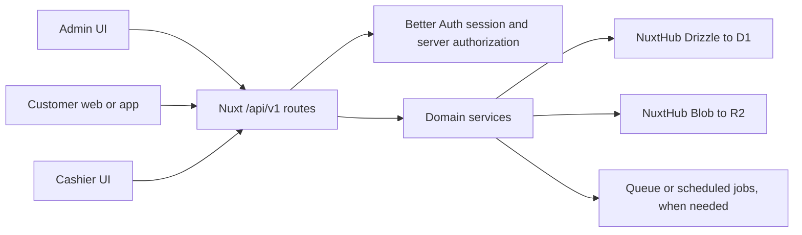

# Full stack backend plan

_Draft, 2026-09-26. The [system blueprint](system-blueprint.md) is the product-level source for this greenfield design. The backend will serve the customer website, admin, and cashier flows; pickup, dine-in, points, vouchers, USD, one branch, email/password customer accounts, and pay-at-counter orders are in the launch scope. This is a new design; no Spring Boot data migration is planned. The schema and route names below are proposals until the remaining business rules in “Decisions to settle” are agreed._

## 1. Goal and boundaries

Build one Nuxt 4 application and Nitro API backed by Cloudflare Workers, D1 (SQLite), and R2. NuxtHub supplies the Drizzle database and blob integration. `@nuxtjs/better-auth` owns authentication tables and sessions. The same API must support the current admin portal and later customer and cashier clients. A separate customer UI may be another Nuxt app, but business rules and writes stay in this backend.

The current frontend and generated Spring SDK are useful **behavioral references**, not the new database or API contract. Reuse a screen or shared UI helper only when it fits the new product contract. Keep the feature boundaries, `useApiQuery`, `useMutation`, form guards, and cross-tab invalidation where they still fit. Replace the Spring proxy, cookie refresh, and external SDK decisions when implementation begins (D2–D6 in `docs/decisions.md`). The admin UI may remain an SPA (`ssr: false`) while Nitro serves its API; decide SSR for the customer website separately. This document does not change runtime behavior.



### Stack fit and deployment

- Use `@nuxthub/core` with `hub.db: 'sqlite'` and `hub.blob: true`. NuxtHub uses a local SQLite file during development and can bind the deployed Worker to D1 and R2. Put application Drizzle tables under `server/db/schema/`; use the NuxtHub generated `@nuxthub/db` client in server code only. [NuxtHub database](https://hub.nuxt.com/docs/database), [schema](https://hub.nuxt.com/docs/database/schema), [blob](https://hub.nuxt.com/docs/blob).
- Install `@nuxthub/core` **before** `@nuxtjs/better-auth` in `modules`. Let the auth module generate its `user`, `session`, `account`, and `verification` schema; reference `#auth/schema` from application tables. Do not hand-edit generated auth tables. Set an auth secret and `NUXT_PUBLIC_SITE_URL` for Cloudflare Workers. [Nuxt Better Auth installation](https://better-auth.nuxt.dev/getting-started/installation), [NuxtHub integration](https://better-auth.nuxt.dev/integrations/nuxthub).
- Use local SQLite for development, separate D1 databases for staging and production, and an environment-specific R2 bucket. Keep migrations in source control; generate with `nuxt db generate`, apply to D1 in a dedicated CI step **before** deploying a Worker that needs them. Workers builds do not apply D1 migrations for us. [NuxtHub migrations](https://hub.nuxt.com/docs/database/migrations), [deployment](https://hub.nuxt.com/docs/getting-started/deploy).
- Begin with database-backed Better Auth sessions. NuxtHub KV is not currently a suitable Better Auth secondary store because required atomic operations are absent; configure database-backed rate limiting for multi-instance deployment. [Nuxt Better Auth NuxtHub notes](https://better-auth.nuxt.dev/integrations/nuxthub).
- Keep image bytes in R2 and metadata/references in D1. Do not place images or large JSON blobs in D1. D1 enforces foreign keys; plan every `ON DELETE` action deliberately. [D1 foreign keys](https://developers.cloudflare.com/d1/sql-api/foreign-keys/).

## 2. Data model

### Conventions shared by all tables

- Use opaque text IDs for new application rows (UUID or ULID, selected once before schema generation). Auth foreign keys must match the module's text user ID. Keep `created_at` and `updated_at` as UTC instants; use `deleted_at` only where retention/audit requires a soft delete. Add `version INTEGER NOT NULL DEFAULT 1` to editable catalog rows for optimistic concurrency.
- Store money as **integer minor units** plus a currency code. This avoids floating-point rounding in D1. Keep the current USD menu UI only if USD is confirmed as the business currency; no automatic currency conversion. Store points as integer units in a separate ledger.
- Use explicit `NOT NULL`, `CHECK`, `UNIQUE`, and foreign keys, with indexes matching real list filters and joins. Use `RESTRICT` for referenced catalog/history rows, `CASCADE` for private children deleted with a parent, and `SET NULL` only where history remains meaningful without the referenced row. Historical order prices, names, tax, discounts, and chosen options are immutable snapshots.
- Use a small set of named status values at the service boundary, backed by SQLite `CHECK` constraints where practical. Do not expose Drizzle row types directly as public API contracts. Public request/response schemas should be explicit Valibot schemas in `shared/`.
- For translatable content, use one `*_translations` child table per aggregate (`locale`, translated fields, unique `(owner_id, locale)`). Keep the primary English name in the parent for sorting/search and require an English translation. This makes fallback and indexed search predictable; do not copy the Spring API's arbitrary i18n maps into the database.

### Identity and access

| Table | Key fields and constraints | Purpose |
|---|---|---|
| Better Auth generated tables | `user`, `session`, `account`, `verification` | Credentials, sessions, linked providers; owned by the auth module. |
| `staff_profiles` | `user_id` PK/FK, display name, employment status | Staff identity separate from login internals. |
| `customer_profiles` | ID PK, `user_id` unique nullable FK, unique member code, display name, phone, status | Customer record; nullable user supports assisted enrollment before account linking if approved. |
| `branches` | unique code, name, timezone, status | Location for fulfillment, cashier actions, and reporting. |
| `dining_tables` | branch FK, unique `(branch_id, label)`, opaque QR token hash unique, status, rotated at | Server-resolved location for dine-in orders; the client does not choose a table ID. |
| `staff_assignments` | `staff_user_id` FK, `branch_id` FK, role, active; unique `(staff_user_id, branch_id, role)` | Server authorization scope. A global admin role needs an explicit policy, not an implicit null branch. |
| `audit_events` | actor user, action, target type/id, branch, occurred at, safe metadata | Append-only record of sensitive staff changes and order state transitions. No secrets or raw payment data. |

Start with named roles and a server-side permission map. Guard **every** Nitro write and sensitive read with a session and permission check. Client route guards only improve UX. Self-service staff signup is disabled; invite or provision the first admin through a controlled bootstrap task. Customer signup and mobile credentials are separate decisions below.

### Menu, schedules, and media (first functional slice)

| Table | Key fields and constraints | Purpose |
|---|---|---|
| `menu_categories` | name, `parent_id` nullable self FK, status, sort order, version; index `(parent_id, sort_order)` | Main and subcategories. Service enforces maximum depth and prevents cycles. |
| `menu_category_translations` | `(category_id, locale)` unique | Localized category name. |
| `menu_products` | `category_id` FK, English name, description, `price_minor`, `currency_code`, `image_asset_id` nullable FK, status, sort order, version; index `(category_id, status, sort_order)` | Menu item. Preserve history by deactivating items used in orders. |
| `menu_product_translations` | `(product_id, locale)` unique | Localized name and description. |
| `product_variant_groups` | `product_id` FK, name, required, selection minimum/maximum, sort order | Choice groups. Minimum/maximum replace the ambiguous pair “required” and “allow multiple”. |
| `product_variant_options` | `group_id` FK, name, `price_delta_minor`, sort order, status | Choices; an order stores the selected option snapshot. |
| `variant_group_translations`, `variant_option_translations` | unique `(group_id, locale)` or `(option_id, locale)` | Localized choice labels. |
| `menu_schedules` | name, timezone, weekday bitmask or normalized days, start/end local minute, overnight flag, status, version | Weekly availability in an explicit IANA timezone. |
| `product_schedules` | composite PK `(product_id, schedule_id)` | One source of truth for the menu item ↔ schedule relation. |
| `media_assets` | R2 object key unique, mime type, byte size, checksum, owner/usage, state, created at | Object metadata and lifecycle; rows reference asset IDs, not raw upload URLs. |

**Schedule rule proposal:** weekdays and times describe local wall time in the schedule's named timezone. A Monday 09:00 schedule means Monday 09:00 in that zone, including daylight-saving changes. Validate overnight ranges explicitly. Decide whether multiple schedules mean **any** match and what an unscheduled product means. Existing frontend UTC conversion (D33) will be replaced only after this new contract is accepted.

**Catalog update rule proposal:** a `PATCH` changes only named scalar fields; nullable fields use explicit `null` to clear. Relationship writes use a dedicated full-replacement `PUT /products/:id/schedules`; variant groups/options use stable IDs and explicit create/update/delete or a documented full replacement in one atomic write. A request carries `version`; a conditional update that affects no row returns `409 CONFLICT`. This resolves the old ambiguity around omitted fields and concurrent editors.

### Orders and payments (second slice)

| Table | Key fields and constraints | Purpose |
|---|---|---|
| `orders` | customer FK, branch FK, dining table nullable FK, order type, fulfillment state, payment state, currency, totals in minor units, notes, timestamps, version; unique public order number | Account-required order with immutable priced totals. Table is required for dine-in and absent for pickup. |
| `order_items` | order FK, product FK nullable, name/description/unit-price snapshots, quantity, line total | Historical order lines even if menu records change. |
| `order_item_options` | order item FK, variant/option IDs nullable, names and price delta snapshots | Exactly what was selected and priced. |
| `order_events` | order FK, actor, from/to state and version, reason, occurred at; unique `(order_id, to_version)` and request key | Append-only fulfillment history and transition audit. |
| `counter_payments` | order FK, cashier FK, amount/currency, method, receipt/reference, collected at, unique idempotency key | Launch payment record; no card details. Method choices still need owner approval. |
| `payment_attempts` and `payment_events` | order/provider references and unique provider event ID | Future online payment extension; not built for launch. |
| `idempotency_keys` | unique `(actor_or_client, operation, key)`, request digest, result reference, expiry | Prevent double order creation, charge initiation, completion, and redemption. |

Order totals are calculated on the server from current catalog/discount rules and saved as snapshots. The cashier transition API checks the current state and permissions, then makes a conditional write and inserts an event in one D1 batch. At launch, the order waits for a cashier to record pay-at-counter collection; preparation is blocked until that succeeds. The exact tender methods and refund policy remain open. If online payments are added later, a provider's signed webhook, rather than a browser return page, becomes the authority for payment success.

### Loyalty and vouchers (third slice; rewards optional)

| Table | Key fields and constraints | Purpose |
|---|---|---|
| `points_accounts` | customer FK unique, cached integer balance, version | Fast balance read; ledger is the source of truth. |
| `points_ledger` | account FK, signed integer delta, reason, source type/id, idempotency key unique, occurred at | Earn, spend, correction, reversal. Never edit a posted entry. |
| `rewards` and `reward_categories` | points cost, product FK optional, validity, status, image asset FK; localized child tables | Optional reward catalog if the owner chooses point-for-reward exchange; separate from menu categories. |
| `reward_redemptions` | customer/reward FKs, points ledger FK, status, timestamps | Optional claim and fulfillment history. |
| `voucher_catalog` | type, product FK optional, price/points cost, use limit, validity policy, status; localized child table | Definition of vouchers that can be purchased, claimed, or issued. |
| `issued_vouchers` | customer FK, catalog FK, unique code hash or opaque code, source, expiry, total/remaining uses, state | Each customer's redeemable entitlement. |
| `voucher_uses` | issued voucher FK, order/branch/staff FKs nullable as required, request key unique, redeemed at | One use per event, auditable and idempotent. |

Award 1 point per USD after completed orders, with the earning base and rounding still to be agreed. Exchanging points for vouchers deducts points and issues the voucher atomically. Staff may also issue vouchers without spending a customer's points, but must provide an auditable reason. Redemptions check `remaining_uses > 0`, expiry, ownership, and allowed state in the write predicate, so two cashiers cannot consume the final use twice. Do not rely on a prior lookup response as authorization. Whether vouchers reserve stock during checkout is a business decision.

### Content and later modules

Add `banners` (localized copy, image asset FK, publication window/order), `notification_deliveries` (recipient, channel, template, status), and `outbox_events` when those features ship. Community posts/comments/moderation and carbon projects/measurements are visible in the old API but need separate domain plans before tables are committed. Avoid creating placeholder tables with guessed semantics. `audit_events` is required from the first slice; public content and notifications are later slices.

## 3. Backend request flow

1. **Route:** Nitro handler under `/api/v1/admin`, `/api/v1/customer`, or `/api/v1/staff` parses path/query/body with shared Valibot contracts; reject unknown fields on writes where feasible. Version the API independently of the database schema. Give every write a bounded body size.
2. **Identity and permission:** Better Auth resolves the session from the request; a server helper loads the staff assignment or customer profile and checks resource/branch ownership. For browser cookie writes, enforce same-origin/CSRF protection and appropriate cookie settings; decide cross-origin/mobile auth separately. Never trust a client-provided role, price, balance, or `customer_id` without scope checks.
3. **Service:** feature-specific service checks business invariants and computes a domain command. Handlers do not contain SQL or R2 lifecycle logic. Reads return deliberate DTOs and paginated metadata; writes return a stable result with a machine-readable error code and safe message.
4. **Persistence:** Drizzle queries D1 with indexes. Use conditional writes for status/version checks. Use one D1 batch for bounded multi-statement invariants and verify its rollback behavior in an integration test; D1 batch is atomic if a statement fails. A conditional update affecting zero rows does **not** itself fail the batch: dependent inserts must also be conditional on the new version, and uniqueness must reject duplicate transitions. Check affected row counts and return `409` for stale requests. Do not assume a chain of separately awaited queries is one transaction. [D1 batch API](https://developers.cloudflare.com/d1/worker-api/d1-database/).
5. **After commit:** publish an outbox event or enqueue side effects (email, push, image cleanup) after durable state is stored. Retry consumers idempotently. API invalidation on the frontend remains feature-scoped; order queues may later use polling or push.

```text
POST /api/v1/admin/products
  session -> permission(menu.write) -> validate -> check category/asset
  -> insert product + translations + variant rows -> audit -> response

POST /api/v1/staff/orders/:id/ready
  session -> permission(order.fulfill, branch) -> idempotency lookup
  -> conditional PREPARING -> READY + order event (atomic)
  -> return current state; duplicate request returns prior result

POST /api/v1/admin/media
  session -> permission(media.write) -> type/size validation
  -> put temporary R2 object -> create media_assets row -> return asset ID
  -> attach to product/banner/reward in a separate guarded request
  -> scheduled cleanup of unattached expired assets
```

**R2 consistency:** an R2 upload and a D1 insert cannot share a transaction. Keep media in `temporary`/`attached` states, use random object keys, restrict MIME and size, and clean up abandoned objects. If metadata creation fails after upload, delete the object or let a temporary-prefix cleanup job find it. Serve public menu images from a controlled public route/domain; serve private files through authenticated routes. A delete first removes references in D1 and then asynchronously deletes an unreferenced object. NuxtHub supports validated uploads through its Blob API. [NuxtHub uploads](https://hub.nuxt.com/docs/blob/upload), [R2 Workers access](https://developers.cloudflare.com/r2/get-started/workers-api/).

## 4. Delivery sequence and acceptance gates

| Phase | Build | Gate |
|---|---|---|
| 0. Runtime spike | Add NuxtHub + Better Auth on a branch; local SQLite/R2 emulation; deploy a private staging Worker with D1/R2; generate/apply a reversible migration; sign in as a seeded admin. | Local and staging session, database and blob smoke tests; CI migration step proven. |
| 1. Identity and menu | Auth roles/branches, audit, categories, schedules, products, variants, media, `/api/v1/admin` and public menu reads. Move existing screens to the new API one feature at a time. | Permissions tested at server routes; catalog create/edit/sort/image flows in browser; old API no longer used by these screens. |
| 2. Customers and orders | Customer identity, branch/availability, cart pricing, order snapshots, cashier queue and state transitions, counter payment. | Concurrent/duplicate order actions tested; totals match snapshots; no state skips. |
| 3. Loyalty and offers | Points ledger, vouchers, redemptions; reward catalog only if approved. | Concurrent last-use voucher and points double-spend tests; ledger can reconcile cached balances. |
| 4. Operations | Banners, notifications, dashboard/reporting, community/carbon after domain plans; retention and backup drills. | Each feature has a written contract, permissions, indexes and end-to-end checks. |

For each phase: write a domain contract, Drizzle schema and checked-in migration; run server integration tests on local SQLite **and** a D1 staging smoke test for database-specific behavior; verify API permission failures; then move the UI. Keep CI lint, typecheck, unit, and browser tests. D1 has per-database throughput and size limits, so inspect query plans and actual row reads before adding caches or read replicas. [D1 limits](https://developers.cloudflare.com/d1/platform/limits/).

## 5. Decisions to settle with the owner

These are product contracts, not defaults to hide in code:

1. **Currency, tax, and branches:** USD and one launch branch are confirmed. Decide tax/service charge, discount and rounding examples; future branch-specific prices/availability are deferred.
2. **Identity:** Customer email/password and account-required ordering are confirmed. Decide required email verification, whether one person can be both customer and staff, and authentication for a future native app.
3. **Permissions:** Exact admin/manager/cashier role matrix and whether staff access is branch-scoped. Who may issue points, void orders, refund, or redeem a voucher?
4. **Order/payment rules:** Pickup, dine-in via a table QR, and pay at counter before preparation are confirmed. Decide pickup/unpaid-order expiry, cancellation/refund windows, offline counter flow, tender methods, and whether staff acceptance is needed.
5. **Loyalty contracts:** 1 point per USD on completed orders, point-for-voucher exchange, and staff issuance are confirmed. Decide earning base/rounding, point expiration, exchange initiator, voucher cost/type/stacking/reservation/expiry/use limit, and refund reversal.
6. **Catalog rules:** Whether unscheduled means always available; multiple schedule union/intersection; overnight behavior; eligible inactive relationships; product availability per branch; translation editing and fallback.
7. **Data and operations:** Retention/deletion/anonymization requirements, image visibility, expected order volume, backup/restore target, and whether existing public clients need a compatibility window with Spring endpoints.

Resolve 1–3 before implementing the corresponding tables/routes, and 4–5 before any live customer transaction. A written decision updates this plan and `docs/decisions.md` before the affected phase begins.
