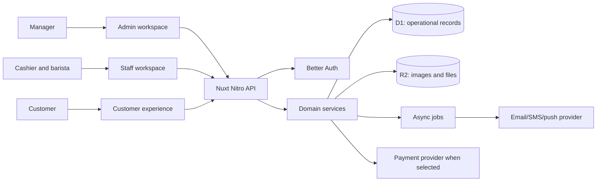
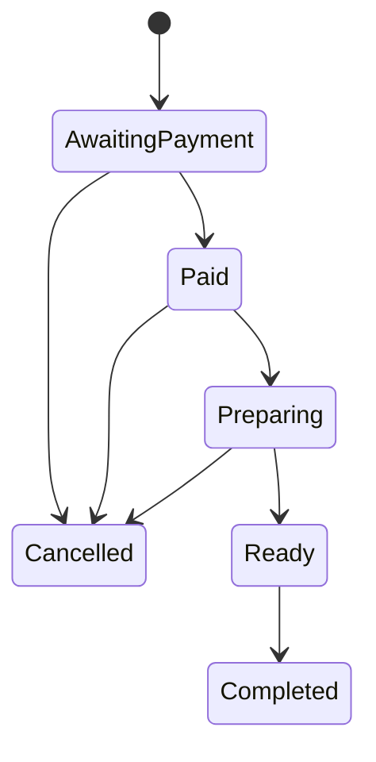
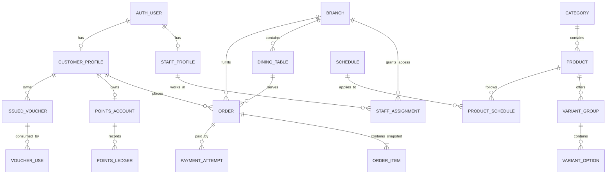

# NUK Cafe system blueprint

_Greenfield product plan, 2026-09-26. This document explains how the cafe platform should work before implementation. The owner confirmed a customer website first, pickup and dine-in orders, points plus vouchers, USD, one branch, email/password accounts without guest checkout, dine-in table QR codes, and pay-at-counter checkout before preparation. Customers earn 1 point per USD after order completion and spend points on vouchers; staff can issue vouchers. Unconfirmed business rules are marked **Open**. The existing Spring API, generated SDK, and admin screen behavior are examples to learn from, not contracts to reproduce. No production data migration is planned._

## 1. Product in one sentence

Customers discover the menu, place and track orders, and use points and vouchers; cafe staff fulfill and redeem them; managers control the catalog, staff, offers, and operations. One Nuxt backend owns those rules and one database records their results.

### Actors and surfaces

| Actor | Surface | Main jobs |
|---|---|---|
| Customer | Customer website first | Browse menu, choose fulfillment method, place/pay for an order, track it, see points and vouchers. |
| Cashier/barista | Staff workspace | View the live queue, accept or reject orders, collect counter payment, mark ready and complete, look up/redeem vouchers. |
| Manager | Admin workspace | Manage menu, schedules, prices, media, banners, offers, staff assignments, and reports; review audit history. |
| Automated worker | Server task/queue | Expire unpaid/reserved orders and vouchers, deliver notifications, retry side effects, clean unused media. |

**System boundary:** the Nuxt/Nitro server owns authorization, prices, order state, points, voucher use, and audit records. A client can request a command; it cannot supply an authoritative price, balance, role, or final state. Better Auth owns credentials and sessions. D1 holds relational state, R2 holds files. A payment service, email/SMS service, and push provider are external integrations only when their corresponding flow is approved.

### Confirmed launch boundary

- One backend serves customer, staff, and manager experiences. The customer-facing experience starts as a website; native mobile authentication and UI are future work.
- Customers can order for pickup or dine-in at one branch, with USD prices and pay-at-counter checkout. Delivery and online payment are outside the confirmed launch scope.
- Customers sign in with email and password; an account is required to order. A dine-in customer scans the table's QR code; the server resolves its opaque token to the active table. Preparation starts only after staff record counter payment.
- Points and vouchers are part of launch, so the first production order flow is not complete until earn/spend and redemption rules are implemented and tested. Completion earns 1 point per USD; points buy vouchers, and staff can issue vouchers without a purchase. The exact earning base/rounding, who initiates exchange, and voucher benefits are still open.

## 2. Capability map

| Capability | Customer result | Staff/manager result | Owner of truth |
|---|---|---|---|
| Identity | Sign in, profile, member code | Provision staff, assign branch and role | Better Auth plus profiles/assignments |
| Catalog | See active, available items and options | Edit categories, products, variants, images, schedules and visibility | Menu domain |
| Cart and pricing | See a trustworthy total before submission | Configure price and offer rules | Server pricing service |
| Ordering | Place and track an order | Accept, prepare, hand over, cancel/reject | Order domain |
| Payment | Pay or choose approved counter method | Collect, reconcile, refund when permitted | Payment attempts/events and provider |
| Loyalty | Earn and spend points | Adjust with reason and permission | Append-only points ledger |
| Offers | Receive and redeem vouchers | Define offers and redeem a customer's entitlement | Voucher domain; reward catalog only if later approved |
| Content | See banners and messages | Publish banners and notifications | Content domain |
| Reporting | See own history | See branch/period totals and audit | Read models derived from source records |

Community posts and carbon features appeared in the old API. Their audience, value, and business rules are **Open**. They are not required to understand or build the ordering core and should receive their own product design before implementation.

## 3. Core journeys

### A. Manager publishes an item

1. Manager signs in; the server checks `menu.write` for the relevant branch or global scope.
2. Manager creates a category, product, option groups, schedule links, price, and optional image. Each write validates references and records an audit event.
3. Draft/inactive content remains invisible to customers. Publishing makes it visible only when category, product, branch, and schedule rules all allow it.
4. Public menu reads return presentation data and current availability; checkout **rechecks** availability and price. A menu read is never a reservation.

**Invariant:** a published product must have a valid category, nonnegative price, supported currency, and valid option rules. Editing a product never changes the price or label stored on an existing order.

### B. Customer orders

1. Customer signs in and chooses pickup or dine-in. For dine-in, they scan the table QR; the server resolves its opaque token to an active table at the launch branch. For pickup, the table is absent. The customer browses the menu and builds a cart. The client may cache this cart, but it is not authoritative.
2. Client asks the server for a checkout quote. The server checks product availability, option selections, voucher eligibility, point use, taxes/discounts, and returns a short-lived quote with a total and expiry.
3. Client submits the quote and an idempotency key. The server recomputes or validates the quote, writes immutable order/item/option snapshots, and records the initial order event.
4. The new order waits for counter payment. A cashier records collection with permission, an amount, method, and idempotency key. Online payment is a future extension; if added, its signed webhook confirms success.
5. Staff may see unpaid orders in a payment queue, but preparation cannot start until payment is recorded. Paid orders enter the preparation queue and move through approved fulfillment states. Customer status is read from the same order record.
6. Completion awards points and consumes any reserved benefit exactly once. Cancellation/refund follows explicit reversal rules.

**Invariant:** order creation, payment events, fulfillment, point awards, and voucher use must be replay-safe. Two concurrent requests cannot spend the same points or final voucher use.

### C. Cashier fulfills and redeems

1. Cashier signs in and sees only orders and redemptions allowed by their branch assignment.
2. A command such as `accept`, `reject`, `ready`, `complete`, or `redeem` includes the current record version and an idempotency key.
3. The server checks permission, branch, allowed transition, expiry, and expected version; then updates state and appends an event atomically.
4. A stale command returns a conflict with the current state so the screen can refresh. A duplicate command returns the prior result. A rejected command has no side effects.

### D. Customer earns, claims, and redeems

1. When a paid order is completed, the customer earns 1 point per USD spent. The server posts one signed ledger entry tied to that order; a manager adjustment requires a reason. The exact amount used for earning and rounding of cents are **Open**.
2. Exchanging points for a voucher checks the account balance, creates a negative ledger entry, and issues the voucher in one atomic operation. Staff can also issue a voucher to a customer with an audited reason; that issuance does not silently spend the customer's points. Who initiates the points exchange is **Open**.
3. A cashier's voucher lookup shows eligibility but does not reserve or consume it. `redeem` performs a fresh conditional check and writes a use event.
4. Refunds and cancelled claims post reversing entries; history is never rewritten. The customer's displayed balance must reconcile to the ledger.

## 4. State machines and invariants

Keep **payment** and **fulfillment** as separate state machines. For example, `payment = SUCCEEDED` and `fulfillment = PREPARING` can coexist. The exact allowed transitions are **Open** until the owner decides fulfillment and payment policy; use the following as a reviewable candidate, not implementation authority:

Payment rule for launch: `UNPAID -> PAID_AT_COUNTER`; an authorized staff command records the collection, and `PREPARING` requires paid state. Cancellation/refund handling and whether a separate staff acceptance step is needed are **Open**. A future online method would use separate `PENDING -> SUCCEEDED | FAILED | EXPIRED` transitions and signed provider events, never a browser redirect alone.

| Rule | Enforcement point |
|---|---|
| Only active, available products can be submitted | Checkout service, not merely menu UI |
| Money uses integer minor units and a currency code | Schema plus pricing service |
| Status/version transitions are conditional | Single database write or bounded D1 batch |
| Order line price/name/options remain historical facts | Snapshot columns; no cascade from catalog edits |
| Point balance never becomes negative | Conditional balance update and ledger entry together |
| Voucher uses never exceed entitlement | Conditional remaining-use update and use event together |
| Every retryable write is idempotent | Unique operation/request key and stored result |
| Every privileged action has an actor and reason where needed | Server permission check and audit event |

## 5. Domain data map

The companion [backend plan](fullstack-backend.md#2-data-model) proposes tables and constraints. The important ownership relationships are:

**Aggregate ownership:** catalog service writes category/product/variant/schedule tables; order service writes orders/items/events; payment service writes attempts and provider events; loyalty service writes points account/ledger; voucher service writes issues/uses. Cross-domain writes require an explicit command and one atomic persistence boundary where a business invariant spans tables. Reporting reads these records; it does not become a second source of truth.

## 6. API shape and client boundaries

- `/api/v1/public/*`: menu, branch hours, published content. No private customer data.
- `/api/v1/customer/*`: checkout quote/order, own orders, profile, points, vouchers, rewards. Derive customer identity from session, never from a trusted body field.
- `/api/v1/staff/*`: branch queue, order commands, voucher lookup/redemption. Branch permission enforced on every route.
- `/api/v1/admin/*`: catalog, staff, offers, media, reporting, audit. Fine-grained permission checks per command.
- `/api/v1/webhooks/*`: signed provider events; no browser session; verify raw payload and deduplicate provider event ID.
- Better Auth routes remain under the auth module's mount path; avoid rebuilding passwords, session cookies, refresh logic, or social login in business routes.

Every route gets an explicit request schema, response schema, permission, error-code list, idempotency policy, and tests. Use the same pagination shape everywhere. Define one error envelope with `code`, safe `message`, and optional field errors; do not copy Spring's HTTP-200 failure envelope. The browser reads through `useApiQuery` and writes through `useMutation` after their transport adapter is updated. A separate native app, if approved, uses the same business routes with an authentication method designed for that client.

## 7. Build order for an implementation agent

The handoff should be a set of small, independently verifiable tasks. Do not give Claude one instruction to "build the whole backend"; each task must have a contract, files, test cases, and a stop condition.

| Milestone | Deliverables | Gate before next milestone |
|---|---|---|
| 0. Contracts | Resolve section 8 decisions; write role matrix, order/payment transitions, pricing examples, API examples | Owner approves product behavior; no unresolved policy hidden in code |
| 1. Platform | NuxtHub local SQLite/R2, staging D1/R2, Better Auth, first-admin bootstrap, migrations, CI deploy sequence | Login and a permissioned read work locally and on staging; migration rollback tested |
| 2. Catalog | Branches, categories, products, variants, schedules, translations, media, public menu API | Admin create/edit/publish and customer read; conflict and availability tests |
| 3. Orders | Quote, checkout, immutable snapshots, idempotency, staff queue/commands, counter-payment record | Concurrent and replay tests; server totals match written examples |
| 4. Loyalty | Points ledger, vouchers, redemption and reversal; reward catalog only if approved | Double-spend/replay tests, ledger reconciliation |
| 5. Launch | Full pickup and dine-in journeys on the customer website, staff fulfillment, points and vouchers | Staging end-to-end journeys, permission review, restore drill |
| 6. Operations | Banners, notifications, reporting, audit UI, retention/restore | Each later feature has its own contract and tests |

At each milestone, update `docs/progress.md`, add accepted decisions to `docs/decisions.md`, add schema migrations, and run lint, typecheck, unit, integration, and browser tests. Keep staging data separate from local and production. The [backend plan](fullstack-backend.md#4-delivery-sequence-and-acceptance-gates) contains the platform-specific setup notes.

## 8. Release test scenarios

These scenarios are required for the first release, in addition to form and list behavior. Every scenario should be reproducible against a staging deployment using test accounts, a test table, and a second test branch for the permission check.

| Scenario | Expected result |
|---|---|
| An anonymous visitor opens a table QR and tries to submit an order | Table/menu may be visible; checkout requires account sign-in. After sign-in, the validated table context is restored. |
| A signed-in customer changes a table ID or uses an inactive/unknown QR token | The server rejects the order or table resolution; no order is written. |
| Menu price, availability, or option rules change after cart construction | Checkout returns a fresh quote or a conflict; stale client prices are not charged. |
| The same customer submits the same checkout key twice | One order exists and both responses identify it. The same key with different content is rejected. |
| Cashier retries a counter payment, or two staff members submit it together | One payment record and one paid transition exist; preparation remains blocked until that transition succeeds. |
| A staff member from the wrong branch tries to view or change an order | Server returns forbidden; no state or audit success event is written. |
| Two staff members transition the same order from one version | One transition wins; the other receives a conflict with the latest state. |
| Completion is retried | The order completes once and points are awarded once at the agreed rate. |
| A points-for-voucher exchange is retried or races another spend | One voucher is issued per idempotency key; balance cannot become negative. |
| Two cashiers redeem the final voucher use concurrently | Exactly one use event succeeds; the other sees the voucher's current unavailable state. |
| A privileged action is performed and a customer requests their own history | Audit has actor/action/target; the customer can read only their own data. |
| A menu image upload succeeds but product save fails | No broken product image reference; temporary object is eventually cleaned up. |

## 9. Product decisions needed before implementation

Mark each answer in a versioned decision record with at least one example. Technical implementation can proceed only for the domains whose policy is settled.

1. **Fulfillment details:** pickup and dine-in are confirmed for the website, accounts are required, and dine-in uses table QR codes. Decide pickup timing, unpaid-order expiry, whether staff acceptance is needed, and the table QR rotation/fallback policy.
2. **Money:** USD and one branch are confirmed. Decide tax/service charge, discounts, rounding examples, and whether counter payment accepts cash, external card terminal, or both.
3. **Identity and roles:** email/password customer sign-in and account-required ordering are confirmed. Decide email verification, staff bootstrap/invitations, admin/manager/cashier permissions, and future mobile authentication.
4. **Payments:** pay at counter before preparation is confirmed; online provider is future work. Decide counter tender methods, refunds, timeouts, and failure recovery.
5. **Ordering:** allowed state transitions, whether staff acceptance is required, cancellation windows, out-of-stock behavior, and no-show/expiry policy.
6. **Loyalty:** 1 point per USD after order completion, points exchanged for vouchers, and staff issuance are confirmed. Decide earning base and rounding, exchange initiator, voucher benefit/cost/expiry/stacking/use limit, and refund reversal rules.
7. **Catalog:** schedule timezone and overnight behavior, unscheduled products, inactive category rules, and translation languages/fallback.
8. **Operations:** expected scale, retention and customer anonymization, notifications, reporting definitions, and restore target.

The answers define the product. The database schema and API examples should be finalized from them, then implementation tasks can be written so Claude has no business-policy gaps to fill on its own.
