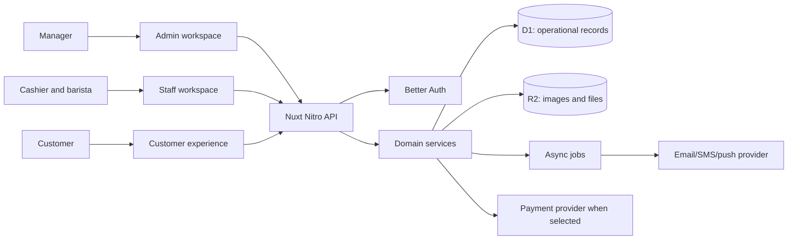
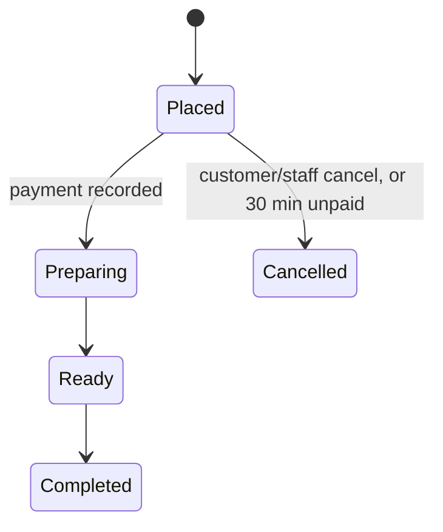

# NUK Cafe system blueprint

_Greenfield product plan, 2026-09-26 (updated 2026-09-27). This document explains **what** the cafe platform must do: actors, journeys, rules and release scenarios. **How** the server is built (routes, code layout, tables, security, operations) is the [server standard](../server/README.md); the build order and the open questions live in [progress.md](../progress.md)._

_Original summary: The owner confirmed a customer website first, pickup and dine-in orders, points plus vouchers, USD, one branch, email/password accounts without guest checkout, dine-in table QR codes, and pay-at-counter checkout before preparation. Customers earn 1 point per USD after order completion and spend points on vouchers; staff can issue vouchers. Business rules decided on 2026-09-27 are in D45; anything still undecided is in progress.md → Open questions. The existing Spring API, generated SDK, and admin screen behavior are examples to learn from, not contracts to reproduce. No production data migration is planned._

## 1. Product in one sentence

Customers discover the menu, place and track orders, and use points and vouchers; cafe staff fulfill and redeem them; managers control the catalog, staff, offers, and operations. One Nuxt backend owns those rules and one database records their results.

### Actors and surfaces

| Actor | Surface | Main jobs |
|---|---|---|
| Customer | Customer website first | Browse menu, choose fulfillment method, place/pay for an order, track it, see points and vouchers. |
| Cashier/barista | Staff workspace | View the live queue, accept or reject orders, collect counter payment, mark ready and complete, look up/redeem vouchers. |
| Manager | Admin workspace | Manage the menu (categories, options, add-ons, items, availability), prices, media, banners, offers, staff, and reports; review audit history. |
| Automated worker | Server task/queue | Expire unpaid/reserved orders and vouchers, deliver notifications, retry side effects, clean unused media. |

**System boundary:** the Nuxt/Nitro server owns authorization, prices, order state, points, voucher use, and audit records. A client can request a command; it cannot supply an authoritative price, balance, role, or final state. Better Auth owns credentials and sessions. D1 holds relational state, R2 holds files. A payment service, email/SMS service, and push provider are external integrations only when their corresponding flow is approved.

### Confirmed launch boundary

- One backend serves customer, staff, and manager experiences. The customer-facing experience starts as a website; native mobile authentication and UI are future work.
- Customers can order for pickup or dine-in at one branch, with USD prices and pay-at-counter checkout. Delivery and online payment are outside the confirmed launch scope.
- Customers sign in with email and password; an account is required to order. A dine-in customer scans the table's QR code; the server resolves its opaque token to the active table. Preparation starts only after staff record counter payment.
- **Deferred (owner, 2026-09-30, D115): points and vouchers are out of the launch scope.** The rules in this document stay as the design for when they come back (phase 7). Originally: points and vouchers are part of launch, so the first production order flow is not complete until earn/spend and redemption rules are implemented and tested. Completion earns 1 point per USD; points buy vouchers, and staff can issue vouchers without a purchase. The earning base, exchange and voucher rules were decided on 2026-09-27 (D45).

## 2. Capability map

| Capability | Customer result | Staff/manager result | Owner of truth |
|---|---|---|---|
| Identity | Sign in, profile, member code | Provision staff, assign branch and role | Better Auth (`admin` + `organization` plugins) |
| Catalog | See active, available items with their options and add-ons | Edit categories, options, add-ons, items, images, availability and visibility | Menu feature |
| Cart and pricing | See a trustworthy total before submission | Configure price and offer rules | Server pricing service |
| Ordering | Place and track an order | Accept, prepare, hand over, cancel/reject | Order domain |
| Payment | Pay or choose approved counter method | Collect, reconcile, refund when permitted | Payment attempts/events and provider |
| Loyalty | Earn and spend points | Adjust with reason and permission | Append-only points ledger |
| Offers | Receive and redeem vouchers | Define offers and redeem a customer's entitlement | Voucher domain; reward catalog only if later approved |
| Content | See banners and messages | Publish banners and notifications | Content domain |
| Reporting | See own history | See branch/period totals and audit | Read models derived from source records |

Community posts and carbon features appeared in the old API. Their audience, value, and business rules are **Open**. They are not required to understand or build the ordering core and should receive their own product design before implementation.

## 3. Core journeys

### A. Manager publishes an item

1. An admin signs in; the server checks the `menu: write` permission.
2. The admin creates (or reuses) a category, option sets (Size), add-on groups (Milk), then the item with its price per version and an optional image. Each write validates references and records an audit event.
3. Draft/archived content remains invisible to customers. Publishing makes an item visible only when its category, availability rules and branch sold-out state all allow it.
4. Public menu reads return presentation data and current availability; checkout **rechecks** availability and price. A menu read is never a reservation.

**Invariant:** a published item must have a valid category, at least one priced version, a supported currency, and valid add-on rules. Editing an item never changes the price or label stored on an existing order.

### B. Customer orders

1. Customer signs in and chooses pickup or dine-in. For dine-in, they scan the table QR; the server resolves its opaque token to an active table at the launch branch. For pickup, the table is absent. The customer browses the menu and builds a cart. The client may cache this cart, but it is not authoritative.
2. Client asks the server for a checkout quote. The server checks that the branch is open, item availability, option and add-on selections and voucher eligibility (one voucher per order), and returns a short-lived quote with a total and expiry. Menu prices are final: no tax or service charge.
3. Client submits the quote and an idempotency key. The server recomputes or validates the quote, writes immutable order/item/option snapshots, and records the initial order event.
4. The new order waits for counter payment (cash in USD or riel at the admin-set rate, or KHQR). A cashier records the collection with an amount, method and idempotency key. An order still unpaid after 30 minutes is cancelled. Online payment is a future extension; if added, its signed webhook confirms success.
5. Staff see unpaid orders in a payment queue. **Recording the payment starts preparation** (no separate accept step); the order then moves to ready and completed. Customer status is read from the same order record.
6. Completion awards points and consumes any reserved benefit exactly once. Cancellation/refund follows explicit reversal rules.

**Invariant:** order creation, payment events, fulfillment, point awards, and voucher use must be replay-safe. Two concurrent requests cannot spend the same points or final voucher use.

### C. Cashier fulfills and redeems

1. Cashier signs in and sees only orders and redemptions allowed by their branch assignment.
2. A command such as `pay`, `ready`, `complete`, `cancel` or `redeem` includes the current record version and an idempotency key.
3. The server checks permission, branch, allowed transition, expiry, and expected version; then updates state and appends an event atomically.
4. A stale command returns a conflict with the current state so the screen can refresh. A duplicate command returns the prior result. A rejected command has no side effects.

### D. Customer earns, claims, and redeems

1. When a paid order is completed, the customer earns 1 point per whole USD paid after the voucher discount ($7.80 → 7 points). The server posts one ledger entry tied to that order; a manual adjustment by a manager or admin requires a reason.
2. Exchanging points for a voucher checks the account balance, creates a negative ledger entry, and issues the voucher in one atomic operation. Staff can also issue a voucher to a customer with an audited reason; that issuance does not silently spend the customer's points. The customer starts the exchange on the website.
3. A cashier's voucher lookup shows eligibility but does not reserve or consume it. `redeem` performs a fresh conditional check and writes a use event.
4. A refund or cancellation after completion reverses the earned points and restores a used voucher if it hasn't expired; history is never rewritten. The customer's displayed balance must reconcile to the ledger.

## 4. State machines and invariants

Decided on 2026-09-27 (D45); the exact states are in [the data model](../server/data-model.md#orders--payment):

Staff and managers may cancel a paid order before it's ready, recording how the money went back; after that, only an admin refund (Q36, D101). A future online payment method would use signed provider events, never a browser redirect alone.

| Rule | Enforcement point |
|---|---|
| Only active, available items can be submitted | Checkout service, not merely menu UI |
| Money uses integer minor units and a currency code | Schema plus pricing service |
| Status/version transitions are conditional | Single database write or bounded D1 batch |
| Order line price/name/options remain historical facts | Snapshot columns; no cascade from catalog edits |
| Point balance never becomes negative | Conditional balance update and ledger entry together |
| Voucher uses never exceed entitlement | Conditional remaining-use update and use event together |
| Every retryable write is idempotent | Unique operation/request key and stored result |
| Every privileged action has an actor and reason where needed | Server permission check and audit event |

## 5–7. Data, API and build order

Moved out of this document so they can't drift:
- **Tables and invariants:** [server standard → data model](../server/data-model.md).
- **Routes, surfaces and conventions:** [server standard → architecture](../server/architecture.md).
- **Security, roles and permissions:** [server standard → security](../server/security.md).
- **Build order (numbered steps):** [progress.md → Next steps](../progress.md#next-steps-recommended-order).

## 8. Release test scenarios

Each scenario is mapped to the tests that prove it, with a hand check on staging, in [release-check.md](release-check.md) (step 10.5).

These scenarios are required for the first release, in addition to form and list behavior. Every scenario should be reproducible against a staging deployment using test accounts, a test table, and a second test branch for the permission check.

| Scenario | Expected result |
|---|---|
| An anonymous visitor opens a table QR and tries to submit an order | Table/menu may be visible; checkout requires account sign-in. After sign-in, the validated table context is restored. |
| A signed-in customer changes a table ID or uses an inactive/unknown QR token | The server rejects the order or table resolution; no order is written. |
| Menu price, availability, or option rules change after cart construction | Checkout returns a fresh quote or a conflict; stale client prices are not charged. |
| The same customer submits the same checkout key twice | One order exists and both responses identify it. The same key with different content is rejected. |
| Cashier retries a counter payment, or two staff members submit it together | One payment record and one paid transition exist; preparation remains blocked until that transition succeeds. |
| A staff member from the wrong branch tries to view or change an order | Server returns forbidden; no state or audit success event is written. |
| Two staff members transition the same order from one version | One transition wins; the other receives a conflict with the latest state. |
| Completion is retried | The order completes once and points are awarded once at the agreed rate. |
| A points-for-voucher exchange is retried or races another spend | One voucher is issued per idempotency key; balance cannot become negative. |
| Two cashiers redeem the final voucher use concurrently | Exactly one use event succeeds; the other sees the voucher's current unavailable state. |
| A privileged action is performed and a customer requests their own history | Audit has actor/action/target; the customer can read only their own data. |
| A menu image upload succeeds but the item save fails | No broken item image reference; temporary object is eventually cleaned up. |

## 9. Product decisions

The open product questions, with what each one blocks, are tracked in one place: [progress.md → Open questions](../progress.md#open-questions--waiting-on-others). Answers are recorded in [decisions.md](../decisions.md) and folded into the server standard. No implementation step fills a business-policy gap on its own.
