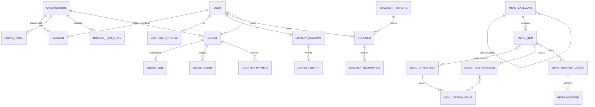

# Data model

← [Server standard](./README.md)

Designed from the product journeys ([system blueprint](../plans/system-blueprint.md)), not from the old external API. Table and column conventions: [architecture.md → Conventions](./architecture.md#conventions). Every table of ours has an `id` (UUID v7), `created_at` and `updated_at`; editable tables add `version`. Money is integer minor units + `currency`.

**[Open]** marks a business rule that isn't decided; the table is shaped so the answer fits later, but no code guesses it.

- [Overview](#overview)
- [Identity (Better Auth)](#identity-better-auth)
- [Branches](#branches)
- [Menu](#menu)
- [Media](#media)
- [Customers & loyalty](#customers--loyalty)
- [Orders & payment](#orders--payment)
- [Platform](#platform)
- [Open questions](#open-questions)

## Overview



Ownership: each feature's repository is the only code that touches its tables ([architecture.md → Features](./architecture.md#features)).

## Identity (Better Auth)

Generated by `@nuxtjs/better-auth` from the auth config; **never edited by hand**. Feature: `identity`. **Tenants (D134, D135):** an organization is a tenant, a cafe business; every tenant-owned table carries `tenant_id` → organization (restrict), and links between a tenant's records are composite foreign keys `(tenant_id, …)`. Tables get it feature by feature ([plan](../plans/multi-tenant.md)): branches, branch staff and the orders family in T1.1; the menu, customers, settings, Telegram and the rest in T1.2–T1.4.

| Table | Our additions | Notes |
|---|---|---|
| `user` | `role` (admin plugin: `customer` | `superadmin`), `banned`, `ban_reason`, `ban_expires`; **`must_change_password`** (additional field) | One row per person, staff or customer, across every tenant. `superadmin` is the platform team's role: no access to a tenant's data |
| `session` | `active_organization_id` (unused: the request names the tenant), `impersonated_by` (plugins) | Database sessions |
| `account` | | Password hash lives here |
| `verification` | | Email verification and reset tokens |
| `rate_limit` | | Auth rate limiting |
| `organization` | = a **tenant** (a cafe business). Additional fields: `status` (`active` | `suspended`), `version` | `slug` unique (the cafe's address, T1.5). Never deleted |
| `member` | `role`: `owner` (everything in the tenant) | `member` (only their branches) | One row per person per tenant; written by our staff routes, never Better Auth's endpoints |
| `invitation` | | Unused (temporary-password onboarding) |

## Branches

Feature: `branches`. Every table here has `tenant_id`; the branch references are `(tenant_id, branch_id)` → `branches(tenant_id, id)`.

| Table | Columns | Invariants |
|---|---|---|
| `branches` | `tenant_id`, `name`, `timezone` (IANA), `currency`, `address`, `phone`, `status` (`active` | `archived`), `version` (the lock for its settings and hours, D91) | A tenant's branch (D135; the ids of the former branch-organizations). Archived, never deleted |
| `branch_staff` | `branch_id`, `user_id` → user (cascade), `role` (`manager` | `staff`) | Who works at a branch (D135). The person is also a `member` of the tenant. Owners need no row |
| `dining_tables` | `branch_id`, `label`, `area` (optional), `status` (`active` | `archived`), `qr_version`, `qr_token_hash` (unique), `qr_rotated_at`, `version` | Labels unique among a branch's **active** tables, ignoring case. The token is rebuilt from `NUXT_QR_SECRET`, the table id and `qr_version` (HMAC), so only its SHA-256 is stored and the admin can show the QR again at any time; rotating increments `qr_version` (D91). A token is global: it names its branch and tenant. At most 200 per branch (a soft cap). Archived, never deleted |
| `branch_hours` | `branch_id`, `weekday`, `start_minute`, `end_minute` | The Availability rules' window shape and checks (shared, `server/utils/weekly-windows.ts`): several a day, past midnight allowed, never overlapping; replaced whole on save. None: never open. **Orders are accepted only while the branch is open** (D45); pickup is "as soon as possible" (no scheduled pickup times) |

## Menu

Brand-wide menu with per-branch state. Feature: `menu`. The design follows how Square, Toast, Uber Eats and Loyverse model menus (research and owner decisions, 2026-09-27, D44).

### Concepts and admin pages

| Admin page | What it holds | Used in the item form as |
|---|---|---|
| **Categories** | A two-level tree: categories and sub-categories | "Category" (a leaf only: a category without sub-categories, top-level or not) |
| **Options** | Reusable **option sets** that define the versions of an item: Size (Small, Regular, Large), Temperature (Hot, Iced). **Names only, no prices** | "Options & prices": pick up to 2 sets; a price grid appears, one price per version (Latte Large $4.50, Tea Large $3.20) |
| **Add-ons** | Reusable **modifier groups** of extras with their **default prices**: Milk (Whole, Oat +$0.50), Extra shot (+$0.75), Sweetness | "Add-ons": pick groups; override a group's selection rules or an add-on's price for this item only when needed |
| **Menu items** | Items, their versions and prices, their add-on groups | |

The difference: an **option** decides *which version* of the item it is (exactly one per option set, priced per item: reports and sold-out work per version). An **add-on** is an *extra* on top (zero or more, priced the same everywhere by default).

```
Item form: Latte
  Category      Coffee › Espresso drinks
  Options       [Size] [Temperature]
                          Hot      Iced
                Small     $3.50    $4.00
                Regular   $4.00    $4.50
                Large     $4.50    $5.00      (a version can be switched off)
  Add-ons       [Milk] [Extra shot] [Sweetness]
```

An item without option sets has exactly one version with one price ("Croissant $2.50").

### Tables

| Table | Columns | Invariants |
|---|---|---|
| `menu_categories` | `parent_id` (nullable, self), `name`, `description`, `sort_order`, `status` (`active` \| `archived`), `version` | **Two levels:** a parent must have no parent. **A category holds either sub-categories or items, never both** (Square's nested categories break when items sit on a parent). Sort order is per parent. Archiving a parent archives its sub-categories |
| `menu_option_sets` | `name` ("Size"), `status`, `version` | Library. Used by many items |
| `menu_option_values` | `set_id`, `name` ("Large"), `sort_order`, `status` | Unique (`set_id`, `name`). Archiving a value hides the versions that use it; it never deletes them |
| `menu_items` | `category_id` (a leaf category), `name`, `description`, `image_asset_id`, `status` (`draft` \| `active` \| `archived`), `sort_order`, `version` | Customers see only `active` items in active categories. An item that was ever ordered is archived, never deleted |
| `menu_item_option_sets` | `item_id`, `set_id`, `sort_order` | PK (`item_id`, `set_id`). **At most 2 per item** |
| `menu_item_variations` | `item_id`, `combination_key` (sorted value ids; unique per item), `price_minor` (null allowed only when not active), `currency`, `status` (`active` \| `disabled` \| `retired`), `sort_order` | **Every item has at least one active variation.** With option sets: exactly one variation per combination of their values (the price grid), created when the sets are attached, "disabled" instead of deleted. Without: one variation with no values. An order line always names a variation |
| `menu_variation_option_values` | `variation_id`, `value_id` | One value per option set of the item; no two variations of an item share the same combination |
| `menu_modifier_groups` | `name` ("Milk"), `min_select`, `max_select` (null = no limit), `status`, `version` | Library. `max_select` ≥ `min_select`. Changes apply to every item using it (the page shows "Used by N items") |
| `menu_modifiers` | `group_id`, `name`, `price_delta_minor` (≥ 0), `is_default`, `sort_order`, `status` | Default price for every item |
| `menu_item_modifier_groups` | `item_id`, `group_id`, `sort_order`, `rules_overridden`, `min_select` / `max_select` (the item's own rules when overridden) | PK (`item_id`, `group_id`); CHECK: overridden rules are valid (`max_select` null or ≥ 1 and ≥ `min_select`) |
| `menu_item_modifier_prices` | `item_id`, `modifier_id`, `price_delta_minor` (≥ 0) | Optional per-item price override ("oat milk +$0.75 on the large-cup drinks"). PK (`item_id`, `modifier_id`) |
| `menu_availability_rules` | `name` ("Breakfast"), `status`, `version` | Library. `version` covers its windows. Names unique among active rules. **Can't be archived while a draft, an active item or an active category uses it** (D63) |
| `menu_availability_windows` | `rule_id`, `weekday` (ISO: 1 = Monday), `start_minute` (0–1439), `end_minute` (1–1440) | Several windows per rule (at most 21), **never overlapping** (D63); PK (`rule_id`, `weekday`, `start_minute`). **Overnight windows are allowed** (D45): an end before the start means the next day, and the window belongs to the weekday it starts on. Times are in the branch timezone |
| `menu_category_availability`, `menu_item_availability` | links to rules (at most 5 each) | **No rule = available whenever the branch is open; several rules = available when any matches** (D45). An item is available only if its category is too, and a sub-category's items only if its parent is too (D63). **An archived rule never matches** |
| `branch_item_states` | `branch_id` → organization, `variation_id`, `sold_out`, `updated_by`, `updated_at` | PK (`branch_id`, `variation_id`). The counter's "86" switch, per version (Large sold out, Regular still available), per branch (D64). Stays until switched back (Q37, owner, D105: no daily reset). Later: a branch price override |
| `menu_translations` | Not at launch | **English only at launch** (D45). Added as `*_translations` tables when a second language is needed |

### Rules that keep the UI clean

- **Changing an item's option sets** regenerates its version grid: existing combinations keep their prices, new combinations start disabled with no price until one is entered, removed combinations are disabled (history keeps them).
- **Adding a value to an option set** (e.g. "Extra large" to Size) does not change existing items; each item's grid shows the new column as disabled until a price is set. **Archiving a value** disables the versions that use it everywhere.
- **Editing an add-on group** (names, default prices, rules) changes every item that uses it; per-item overrides stay. Library edits don't re-check items' own rules (D61): an item whose own minimum no longer fits the group's active add-ons is capped at the quote (step 6.1).
- **Order lines snapshot** the item name, the version's option values ("Large, Iced"), its price, and each add-on's name and price, so later edits never change past orders.
- **Price of a line** = the version's `price_minor` + each chosen add-on's price (the item override if present, else the default).

### Categories API (step 3.1, D55)

Feature `server/features/menu/` (`categories.*`), contract `shared/contracts/menu-categories.ts`, permission `menu:read` / `menu:write`. Every write is one batch with its guards and an audit row (`menu.category.create|update|move|archive|restore|reorder`).

| Route | Does |
|---|---|
| `GET /api/admin/menu/categories?status=active\|archived\|all` | The tree in order: each top-level category followed by its sub-categories; `childCount` = active sub-categories |
| `GET /api/admin/menu/categories/{id}` | One category |
| `POST /api/admin/menu/categories` | `{ name, description?, parentId? }` → 201, at the end of its level |
| `PATCH /api/admin/menu/categories/{id}` | `{ version, name?, description?, parentId? }`: absent keeps; a new `parentId` moves it (`null`: to the top level) to the end of its new siblings |
| `POST /api/admin/menu/categories/{id}/archive` | `{ version }`: archives it and its active sub-categories |
| `POST /api/admin/menu/categories/{id}/restore` | `{ version }`: restores this one only, at the end of its level |
| `PUT /api/admin/menu/categories/order` | `{ parentId, items: [{ id, version }] }`: every active child of that parent, in the new order |

| Case | Result | Test |
|---|---|---|
| A sub-category under a sub-category, or a category with sub-categories moved under another (or under itself) | 422 `CATEGORY_DEPTH` | ✔ |
| Parent unknown or archived (also if archived between the check and the write) | 422 `PARENT_NOT_AVAILABLE` | ✔ (incl. the race) |
| Moving a category that gets a sub-category between the check and the write | 409 `VERSION_CONFLICT`, nothing changes | ✔ (race) |
| Two active siblings with the same name (case-insensitive), also two creates at once | 409 `CATEGORY_NAME_TAKEN` (partial unique indexes); archived ones don't count | ✔ (incl. the race; also on D1) |
| Stale version (before or during the write) | 409 `VERSION_CONFLICT` | ✔ (incl. the race) |
| Editing or archiving an archived category; restoring an active one | 409 `INVALID_STATE` | ✔ |
| Restoring a sub-category whose parent is archived | 409 `PARENT_ARCHIVED` | ✔ |
| Reorder missing a sibling, naming an old version, or a sibling added meanwhile | 409 `VERSION_CONFLICT`, nothing changes | ✔ (incl. the race) |
| Unknown body field | 400 (strict objects) | staging |

Positions (`sortOrder`) keep gaps after archiving and may tie after simultaneous creates (ties sort by name); only the relative order matters, and a reorder rewrites them 1…n. **"Items only in leaf categories"**: the category side (no sub-category under a sub-category) is enforced now; the item side (no item in a category with sub-categories, and no sub-category added to a category with items) comes with menu items in step 3.5.

### Options library API (step 3.3, D58)

Same feature (`options.*`), contract `shared/contracts/menu-options.ts`, permission `menu:read` / `menu:write`. **The set's `version` covers its values:** every change to a set or one of its values sends the set's version and moves it, so two admins can't overwrite each other's edits of one set. Each response is the whole set with its values (active ones in order, then archived ones). Audited as `menu.option_set.<action>`.

| Route | Does |
|---|---|
| `GET /api/admin/menu/option-sets?status=active\|archived\|all` | Sets by name, with their values |
| `GET /api/admin/menu/option-sets/{setId}` | One set |
| `POST /api/admin/menu/option-sets` | `{ name, values: [names] }` (1–20, unique) → 201 |
| `PATCH /api/admin/menu/option-sets/{setId}` | `{ version, name }` |
| `POST …/{setId}/archive`, `…/restore` | `{ version }` |
| `POST …/{setId}/values` | `{ version, name }` → 201, at the end |
| `PATCH …/{setId}/values/{valueId}` | `{ version, name }` |
| `POST …/{setId}/values/{valueId}/archive`, `…/restore` | `{ version }` (restore puts it at the end) |
| `PUT …/{setId}/values/order` | `{ version, valueIds }`: every active value, once |

| Case | Result | Test |
|---|---|---|
| Two active sets with the same name (case-insensitive), also two creates at once | 409 `OPTION_SET_NAME_TAKEN`; the losing create leaves no values behind | ✔ (incl. the race) |
| Two active values of one set with the same name | 409 `OPTION_VALUE_NAME_TAKEN`; the same name in another set is fine | ✔ |
| Stale set version (before or during the write), or two edits of one set at once | 409 `VERSION_CONFLICT`, nothing changes | ✔ (incl. both races) |
| Editing an archived set or value; restoring what isn't archived | 409 `INVALID_STATE` | ✔ |
| Archiving the last active value (also if another is archived meanwhile) | 422 `LAST_OPTION_VALUE`: archive the set instead | ✔ (incl. the race) |
| More than 20 active values (also if one is added meanwhile) | 422 `TOO_MANY_OPTION_VALUES` | ✔ (incl. the race) |
| A value of another set in the path | 404 | ✔ |
| Reorder that isn't exactly the active values | 409 `VERSION_CONFLICT` | ✔ |

**Not yet:** "used by N items" and what archiving a set or value does to items (hiding their versions) come with menu items in step 3.5.

### Add-ons library API (step 3.4, D59)

Same feature (`modifiers.*`), contract `shared/contracts/menu-modifiers.ts`. The API and tables say **modifier groups** (the data model's term); the admin screen says **Add-ons**. Same shape as the Options library: the group's `version` covers its add-ons, every response is the whole group, audited as `menu.modifier_group.<action>` (a price change records `from` and `to`).

| Route | Does |
|---|---|
| `GET /api/admin/menu/modifier-groups?status=active\|archived\|all` | Groups by name, with their add-ons |
| `GET /api/admin/menu/modifier-groups/{groupId}` | One group |
| `POST /api/admin/menu/modifier-groups` | `{ name, minSelect?, maxSelect?, modifiers: [{ name, priceDeltaMinor?, isDefault? }] }` (1–30) → 201 |
| `PATCH …/{groupId}` | `{ version, name?, minSelect?, maxSelect? }` (`maxSelect: null` = no limit) |
| `POST …/{groupId}/archive`, `…/restore` | `{ version }` |
| `POST …/{groupId}/modifiers` | `{ version, name, priceDeltaMinor?, isDefault? }` → 201, at the end |
| `PATCH …/{groupId}/modifiers/{modifierId}` | `{ version, name?, priceDeltaMinor?, isDefault? }` |
| `POST …/{groupId}/modifiers/{modifierId}/archive`, `…/restore` | `{ version }` |
| `PUT …/{groupId}/modifiers/order` | `{ version, modifierIds }` |

**Selection rules** (`modifiers.rules.ts`, checked before every write with a precise message and again inside the batch): 1–30 active add-ons; `minSelect` ≤ active add-ons; `maxSelect` is `null` or ≥ 1 and ≥ `minSelect`; pre-selected (default) add-ons ≤ `maxSelect`. Prices are whole cents, 0 to $100.

| Case | Result | Test |
|---|---|---|
| Rules the add-ons can't meet (minimum above the active count, maximum below the minimum or the defaults) | 422 `SELECTION_RULES` with the field and a sentence ("Customers must choose 2, but only 1 add-on is active.") | ✔ |
| Archiving an add-on below the minimum, or the last one | 422 `SELECTION_RULES` (archive the group instead) | ✔ (incl. a race) |
| Pre-selecting one more than the maximum (also if another is pre-selected meanwhile) | 422 `SELECTION_RULES` | ✔ (incl. the race) |
| Duplicate names (groups; add-ons within a group), also two creates at once | 409 `MODIFIER_GROUP_NAME_TAKEN` / `MODIFIER_NAME_TAKEN` | ✔ (incl. the race) |
| Stale version, or two edits of one group at once | 409 `VERSION_CONFLICT` | ✔ (incl. both races) |
| Editing an archived group or add-on; restoring what isn't archived | 409 `INVALID_STATE` | ✔ |
| An add-on of another group in the path | 404 | ✔ |


### Menu items API (step 3.5a, D60)

Same feature (`items.*`, the grid rules in `items.rules.ts`), contract `shared/contracts/menu-items.ts`. The item's `version` covers the item, its option sets, its variations and its add-on groups. Audited as `menu.item.<action>`.

| Route | Permission | Does |
|---|---|---|
| `GET /api/admin/menu/items?page&pageSize&search&categoryId&status` | `menu:read` | Summaries by category, then position: category name, image, the sellable price range. Default status: drafts and active (`status=archived` or `all` on request) |
| `GET /api/admin/menu/items/{itemId}` | `menu:read` | The item with its option sets and variations |
| `POST /api/admin/menu/items` | `menu:write` | `{ categoryId, name, description?, imageId?, optionSetIds?, variations, modifierGroups? }` → 201, a **draft** at the end of its category |
| `PATCH /api/admin/menu/items/{itemId}` | `menu:write` | `{ version, categoryId?, name?, description?, imageId?, optionSetIds?, variations?, modifierGroups? }`: absent keeps; `imageId: null` removes; `optionSetIds` needs `variations`; `modifierGroups` replaces the whole list |
| `POST …/{itemId}/publish`, `…/unpublish` | `menu:publish` | draft ↔ active |
| `POST …/{itemId}/archive`, `…/restore` | `menu:write` | draft/active → archived; archived → draft (at the end of its category) |
| `PUT /api/admin/menu/items/order` | `menu:write` | `{ categoryId, items: [{ id, version }] }`: every draft and active item of the category |

**The price grid:** `variations` is always the whole grid, every combination of the chosen option sets' **active** values exactly once, each `{ valueIds, priceMinor, status: 'active' | 'disabled' }`. A variation's id never changes: it's matched by its combination, so changing prices keeps ids, removing an option set **retires** its variations (kept for history and orders), and adding it back revives them. A variation that uses an archived value is kept but hidden from the grid and not sellable; restoring the value brings it back. Sellable = active, priced, no archived value.

| Case | Result | Test |
|---|---|---|
| Category unknown or archived / has sub-categories (also if one is added meanwhile) | 422 `CATEGORY_NOT_AVAILABLE` / `CATEGORY_NOT_A_LEAF` | ✔ (incl. the race) |
| A sub-category added to a category that holds drafts or active items (also if one arrives meanwhile, on create and on move) | 422 `CATEGORY_HAS_ITEMS`; archived items don't hold a category | ✔ (incl. both races) |
| A new option set that's archived (also if archived meanwhile); more than 2 | 422 `OPTION_SET_NOT_AVAILABLE` / 400; an archived set already on the item stays | ✔ (incl. the race) |
| Grid missing a combination, listing one twice, wrong shape, an archived value, an active cell without a price, nothing switched on | 422 `PRICE_GRID` with the field and a sentence | ✔ (rules: 9 tests) |
| An option value archived meanwhile | 422 `PRICE_GRID` ("reload the item") | ✔ (race) |
| A value added to a set later | That item's grid is "missing 1 combination" until it's priced or switched off | ✔ |
| Image gone or used by another record | 422 `MEDIA_NOT_AVAILABLE`; replacing or removing releases the old image | ✔ |
| Stale version (before or during the write) | 409 `VERSION_CONFLICT` | ✔ (incl. the race) |
| Editing an archived item; publishing a non-draft; restoring a non-archived one | 409 `INVALID_STATE` | ✔ |
| Publishing with nothing sellable | 422 `NOTHING_TO_SELL` | ✔ |
| Restoring into a category that has since got sub-categories | 422 `CATEGORY_NOT_A_LEAF` | ✔ |

Option sets now report `itemCount` (drafts and active items using them).

### Add-ons on items (step 3.5b, D61)

`modifierGroups` is the item's list of add-on groups, in order (at most 10, each once): `[{ groupId, rules?: { minSelect, maxSelect } | null, prices?: [{ modifierId, priceDeltaMinor }] }]`. `rules: null` (the default) uses the group's rules; `prices` are this item's own prices for some of the group's add-ons (whole cents, 0 to $100, one per add-on). When sent, it replaces the list, the rules and the prices; when absent, all stay.

The item returns each group with what applies **on this item**: `minSelect` / `maxSelect` (its own if `rulesOverridden`, else the group's), and each add-on's `priceDeltaMinor` (its own if `priceOverridden`, else the default) next to `defaultPriceDeltaMinor`, `isDefault` and `status`. Add-ons: the group's active ones in order, then archived ones the item has a price for. Add-on groups now report `itemCount` (drafts and active items offering them).

| Case | Result | Test |
|---|---|---|
| A group that doesn't exist, or is archived and not already on the item (also if archived meanwhile, on create and update) | 422 `MODIFIER_GROUP_NOT_AVAILABLE` on `modifierGroups.<i>.groupId` | ✔ (incl. both races) |
| A group archived in the library that the item already offers | Stays, shown with `status: 'archived'`; the form can send it back | ✔ |
| Own rules the group's active add-ons can't meet (minimum above the active count, maximum below the minimum or the defaults) | 422 `ITEM_SELECTION_RULES` on `modifierGroups.<i>.rules[.minSelect|.maxSelect]` | ✔ |
| A price for an add-on of another group, or an archived one not priced before (also if archived meanwhile) | 422 `MODIFIER_NOT_AVAILABLE` on `modifierGroups.<i>.prices.<j>.modifierId` | ✔ (incl. the race) |
| An archived add-on the item has a price for | Keeps its price, listed after the active ones, back in place when restored | ✔ |
| A group twice, a price twice, more than 10 groups, a negative price | 400 (contract) | ✔ |
| The library's default price or rules change | Items without their own follow; own prices and rules stay | ✔ |
| Stale item version | 409 `VERSION_CONFLICT` | ✔ |

### Public menu (step 3.8a, D65)

`GET /api/public/menu?branchId=…` (anyone, `no-store`, contract `shared/contracts/public-menu.ts`; without `branchId`, the first active branch by name, D95; none at all is 404): `{ branch, currency, at, categories }`. `branch` is a `PublicBranch` (below). Each top-level category holds `categories` (its sub-categories) or `items`; each item has `optionSets`, `variations` (`{ id, valueIds, label, priceMinor, soldOut }`), `soldOut` (every version is) and `modifierGroups` (the rules and prices that apply on it).

`POST /api/public/checkout/quote` (anyone, same-site origin, `no-store`, contract `shared/contracts/orders.ts`, D98) `{ branchId, lines: [{ itemId, variationId, modifierIds, quantity, note }] }` (1–30 lines, 1–20 each, each add-on once, a note up to 140 characters; no prices accepted): the lines read against `GET /api/public/menu` for that branch at this moment, `{ branch, currency, at, expiresAt (at + 10 min), lines, subtotalMinor, totalMinor, problems, orderable }`. Each line is priced (`unitPriceMinor` = the version's price + the add-ons' prices on this item, `totalMinor` = × quantity) or carries its first `problem`: `ITEM_UNAVAILABLE`, `VERSION_UNAVAILABLE`, `ADD_ON_UNAVAILABLE` (with `modifierIds`), `CHOICE_INVALID` (a group's minimum or maximum), `SOLD_OUT`. Each line also lists its priced `modifiers`. Totals count the lines without a problem; `BRANCH_CLOSED` and `LAST_ORDERS_PASSED` (open, but closing within 15 minutes, D99) are order problems. Nothing is stored or reserved: placing the order (6.2) prices it again.

`GET /api/public/branches` (anyone, `no-store`, D93): the active branches by name as `PublicBranch` (`{ id, name, address, phone, timezone, openNow, closesInMinutes, nextOpening }`). `openNow` follows the branch's hours on its own clock; `closesInMinutes` counts to the end of the open stretch (through back-to-back windows and past midnight, `null` while closed, D99); `nextOpening` (`{ inDays, weekday, startMinute }`, 0 days = later today) says when a closed branch opens, `null` while open or without hours.

| Shown | Rule |
|---|---|
| Categories | Active, with something to show (empty ones are left out) |
| Items | Active, in an active category, available now on the branch's clock (item, category and parent rules; an archived or missing rule never matches) |
| Versions | Sellable (active, priced, no archived value); sold out at this branch → `soldOut: true`, still listed (D93; hidden until then, D65) |
| Option values | Only those a listed version uses |
| Add-ons | Active groups and add-ons; the item's own prices and rules; the minimum capped at the add-ons offered |

A menu read is never a reservation: checkout checks everything again (6.1–6.2). No cache yet (D65); `loadCatalog` is the part a cache would hold.

### Sold out per branch (step 3.6, D64)

Same feature (`soldout.*`), contract `shared/contracts/menu-sold-out.ts`, on the **counter surface**: the branch comes from the path and `requireBranchPermission` checks the caller's membership.

| Route | Permission | Does |
|---|---|---|
| `GET /api/counter/{branchId}/sold-out` | `menu:read` | What's sold out at the branch: `{ branchId, variations: [{ variationId, itemId, itemName, label, updatedAt, updatedBy, updatedByName }] } (`updatedByName` since D105; `null` when the account is gone)` by item name, then version |
| `PUT /api/counter/{branchId}/sold-out` | `menu:setSoldOut` (staff, manager, admin) | `{ variationIds (1–400), soldOut }`: sets the state (never toggles) and returns the list. Audited as `menu.sold_out.set` |

| Case | Result | Test |
|---|---|---|
| Staff of another branch, a customer, an unknown or archived branch | 404 (from `requireBranchPermission`) | ✔ |
| Sold out at one branch | Still on sale at the others | ✔ |
| The same request twice, or two at once | Same end state; the first person to switch it stays on record | ✔ |
| Back on sale for something never switched off | Nothing stored | ✔ |
| A draft item, a switched-off version | Accepted: applies once they're sold | ✔ |
| An unknown or retired version, an archived item | 422 `VARIATION_NOT_AVAILABLE` on `variationIds.<i>`; nothing changes | ✔ |
| The item is archived, or the version retired, later | Hidden from the list; shown again if it returns | ✔ |
| A version listed twice, more than 400 | 400 (contract) | contract |

### Availability rules API (step 3.7, D63)

Same feature (`availability.*`, the window rules in `availability.rules.ts`), contract `shared/contracts/menu-availability.ts`, permission `menu:read` / `menu:write`. The rule's `version` covers its windows; every response is the whole rule with `itemCount` (drafts and active items) and `categoryCount` (active categories). Audited as `menu.availability_rule.<action>` (a window change records `from` and `to`).

| Route | Does |
|---|---|
| `GET /api/admin/menu/availability-rules?status=active\|archived\|all` | Rules by name, with their windows (by weekday, then start) |
| `GET …/{ruleId}` | One rule |
| `POST /api/admin/menu/availability-rules` | `{ name, windows: [{ weekday, startMinute, endMinute }] }` (1–21) → 201 |
| `PATCH …/{ruleId}` | `{ version, name?, windows? }`: `windows` replaces them all |
| `POST …/{ruleId}/archive`, `…/restore` | `{ version }` |

Items and categories choose their rules with `availabilityRuleIds` (at most 5, each once) on create and update (absent keeps, `[]` removes), and return `availabilityRules: [{ id, name, status }]` by name.

**When something is available** (`isAvailableAt`, pure): the branch's local time (`localTime(instant, timeZone)`) falls in a window of an **active** rule at every level that has rules: the item, its category, the parent category. A window includes its start and excludes its end.

| Case | Result | Test |
|---|---|---|
| Two windows of a rule overlap (overnight ones included, Sunday night into Monday too); touching is fine | 422 `AVAILABILITY_WINDOWS` on `windows.<i>` | ✔ (rules) |
| A window starting and ending at the same minute, a weekday outside 1–7, more than 21 windows | 400 (contract) | contract |
| Two active rules with the same name (case-insensitive), also two creates at once | 409 `AVAILABILITY_RULE_NAME_TAKEN` | ✔ (incl. the race) |
| Stale version (before or during the write) | 409 `VERSION_CONFLICT` | ✔ (incl. the race) |
| Editing or archiving an archived rule; restoring an active one | 409 `INVALID_STATE` | ✔ |
| Archiving a rule a draft, active item or active category uses (also if one starts using it meanwhile) | 409 `AVAILABILITY_RULE_IN_USE`; archived items and categories don't count | ✔ (incl. both races) |
| An item or category choosing an unknown or archived rule (also if archived meanwhile, on create and update) | 422 `AVAILABILITY_RULE_NOT_AVAILABLE` on `availabilityRuleIds.<i>` | ✔ (incl. the races) |
| An archived rule an item or category already uses (it was archived while they were) | Stays, shown with `status: 'archived'`, never matches; the form can send it back | ✔ |

Sources: [Square item options](https://developer.squareup.com/docs/catalog-api/item-options), [Square option sets](https://squareup.com/help/us/en/article/6689-item-options), [Square nested categories (community)](https://community.squareup.com/t5/Orders-Menu-Items-Catalog/Getting-Sub-categories-to-show-when-parent-category-is-selected/td-p/827866), [Toast menu hierarchy](https://doc.toasttab.com/doc/platformguide/adminMenuHierarchy.html), [Toast shared modifier groups](https://support.toasttab.com/en/article/Shallow-and-Deep-Copying-Menu-Items-and-Modifiers), [Uber Eats menu structure](https://developer.uber.com/docs/eats/guides/menu-integration), [Loyverse variants vs modifiers](https://help.loyverse.com/help/how-use-variants-items).

## Media

Feature: `media`.

| Table | Columns | Invariants |
|---|---|---|
| `media_assets` | `object_key` (unique), `mime_type`, `byte_size` (> 0), `sha256`, `state` (`temporary` \| `attached`), `uploaded_by`, `created_at`, `state_changed_at` | Temporary assets whose state is older than 24 h are deleted with their R2 object. An asset is attached to **one** record at a time |

Built in step 3.2 (D57): `server/features/media/`, contract `shared/contracts/media.ts`.

| Use | How |
|---|---|
| Upload | `POST /api/admin/media` (multipart, field `file`, permission `media:upload`) → 201 `{ id, url, mimeType, byteSize }`; audited as `media.asset.upload` |
| Serve | `GET /media/<key>` (public, `nosniff`, cached for a year: keys never change) |
| A record starts using an upload | `media.attachStatements(db, assetId, field)` in the record's batch: checks it now (422 `MEDIA_NOT_AVAILABLE` on `field`) and guards it in the batch (map a stale batch to `mediaNotAvailable(field)`) |
| A record drops or replaces it | `media.releaseStatement(db, assetId)` in the same batch; its 24 hours start then |
| Cleanup | `media:purge-temporary`, hourly at :05 |

| Case | Result | Test |
|---|---|---|
| Bytes aren't JPEG/PNG/WebP, or don't match the claimed type (an SVG or HTML file renamed `.png`) | 415 `UNSUPPORTED_MEDIA`, nothing stored | ✔, real-server |
| Over 5 MB | 413 `PAYLOAD_TOO_LARGE` (by `Content-Length` before reading, and by size after) | ✔, real-server |
| No file, or an empty one | 400 `VALIDATION_FAILED` | ✔, real-server |
| Storing the object fails | No row | ✔ |
| Writing the row fails | The object is removed again | ✔ |
| Two records attach the same upload at once | One wins; the other's batch fails its guard | ✔ (race) |
| An upload is cleaned up between a record's check and its write | The record's batch fails its guard | ✔ (race) |
| A record attaches an upload between the purge finding it and deleting it | Kept (conditional delete) | ✔ (race) |
| The object can't be removed after its row was deleted | Reported and logged; the object stays in R2 (no record can point at it) | ✔ |

## Customers & loyalty

Features: `customers`, `loyalty`.

| Table | Columns | Invariants |
|---|---|---|
| `customer_profiles` | `user_id` (PK, → user, cascade), `member_code` (unique, shown as a QR at the counter), `phone`, `marketing_opt_in`, `anonymized_at`, `created_at` | Every account has one, staff included: created on sign-up (Better Auth hook), in the staff-creation batch, or on first use. Member code: 8 random Crockford base32 characters shown `XXXX-XXXX` (40 bits; no I, L, O, U); typed codes are normalized (case, spaces, dashes, look-alikes) |
| `loyalty_accounts` | `user_id` (PK), `balance` (cached), `version` | `balance` ≥ 0, and always equals the sum of its entries |
| `loyalty_entries` | `account_id`, `points` (signed), `reason` (`earn_order` \| `exchange_voucher` \| `adjust` \| `reverse`), `source_type`, `source_id`, `idempotency_key` (unique), `actor_id`, `note` | **Append-only.** A correction is a new `reverse`/`adjust` entry with a reason |
| `voucher_templates` | `kind` (`amount_off` \| `free_item`), `amount_minor` (amount off), `variation_id` (free item), `points_cost` (null = staff-issue only), `valid_days` (default 30), `uses_per_voucher` (default 1), `status`, `version` | **One voucher per order, no minimum spend** (D45). An amount-off voucher never makes a total negative; a free item needs that item in the order |
| `vouchers` | `template_id`, `owner_id` → user, `code_hash` (unique), `source` (`points_exchange` \| `staff_issue`), `issued_by`, `issue_reason`, `remaining_uses`, `expires_at`, `status` (`active` \| `used` \| `expired` \| `revoked`), `version` | Exchange = negative loyalty entry + voucher **in one batch** |
| `voucher_redemptions` | `voucher_id`, `order_id`, `branch_id`, `staff_id`, `idempotency_key` (unique) | Conditional `remaining_uses > 0` update in the same batch: two cashiers can't use the last use twice |

Rules (D45):
- **Earning:** on completion, `floor(amount paid after the voucher discount / 1 USD)` points ($7.80 → 7). Entry key `earn:order:{orderId}`, so it applies once.
- **Exchange:** the **customer** exchanges points for a voucher on the website; staff redeem at the counter. The debit and the voucher are one batch.
- **Issue:** admins and managers may issue a voucher to a customer, with a reason (audited); it doesn't cost the customer points.
- **Adjust:** admins and managers may add or remove points with a reason.
- **Reversal:** when a completed order is refunded or cancelled, its earned points are reversed and a voucher used on it is restored if not expired.
- Staff never act on their own account (security.md → Identity).

## Orders & payment

Feature: `orders`.

| Table | Columns | Invariants |
|---|---|---|
| `orders` (**built, 6.2, D99**) | `branch_id` → organization (restrict), `customer_id` → user (restrict), `business_date` (`YYYY-MM-DD`, the branch's day starting at 4:00, Q39), `pickup_number`, `status` (`awaiting_payment` \| `preparing` \| `ready` \| `completed` \| `cancelled`; 6.2 creates `awaiting_payment` only), `order_type` (`pickup` \| `dine_in`), `table_id` (a `dining_tables` id, no cross-feature FK: tables are archived, never deleted) and `table_label` (as it was), `paid_at`, `ready_at`, `completed_at`, `cancelled_at` (6.3), `version` (+1 per status change), `subtotal_minor`, `total_minor`, `currency`, `placed_at`, `payment_due_at` (placed + 30 min), `cancelled_at`, `version` | `CHECK`s: the status list; `table_id` set exactly for `dine_in`; amounts ≥ 0. **Unique (`branch_id`, `business_date`, `pickup_number`)**: the number is computed in the insert itself (`max + 1` for that branch and day, one statement, so two orders can't read the same maximum), the index is the final guard. Totals are computed by the server. **No tax or service charge: menu prices are final** (D45). Added later as columns: `payment_status` (6.4), `voucher_id` and `discount_minor` (7.5) |
| `order_lines` (**built, 6.2**) | `order_id` → orders (cascade), `position`, `item_id`, `variation_id` (kept for reports, no FK: menu records can be reset in test environments, D94), **snapshots** `item_name`, `category_id` and `category_name` (the item's category when sold, its sub-category if it has one; nullable for lines whose item had left the menu, 8.1, D110), `detail` ("Large, Iced · Oat milk"), `modifiers` (JSON `[{ id, name, priceDeltaMinor }]`), `unit_price_minor`, `quantity`, `total_minor`, `note` (≤ 140) | Never changed after placing. `CHECK`: quantity 1–20, `total = unit × quantity`. Unique (`order_id`, `position`); index `item_id` (Sales by item) |
| `order_events` (**built, 6.3, D101**) | `order_id` → orders (cascade), `to_version`, `actor_id` → user (`null` = the system), `from_status` (`null` when placed), `to_status`, `reason` (`customer_changed_mind` \| `item_unavailable` \| `other`) and `note` (a cancellation), `at`; unique (`order_id`, `to_version`) | One row per version, in the same batch as the change: placed, paid, ready, completed, cancelled. The unique version is a second guard against two commands on one version |
| `counter_payments` (**built, 6.3, D101**) | `order_id` → orders (restrict, **unique**), `branch_id`, `method` (`cash_usd` \| `cash_khr` \| `khqr`), `amount_minor` (always the order's total), `amount_khr` and `khr_per_usd` (cash in riel only: the riel asked for, rounded up to ៛100, and the rate used; `CHECK`), `reference` (KHQR, optional), `khqr_charge_id` → khqr_charges (the QR the counter showed, 10.15, D130), `collected_by`, `collected_at`; `return_method` (`cash` \| `khqr`), `returned_by`, `returned_at` (a paid order cancelled before ready, Q36; all or none) | One payment per order (unique index, the last guard); recording it starts preparation. Indexes (`branch_id`, `collected_at`) and (`branch_id`, `returned_at`) for the reports (D110). The retry key lives in `idempotency_keys` (operation `orders.pay`), like placing an order |
| `khqr_settings` (**built, 10.15, D130**) | one row (`id` = `default`): `enabled`, `account_id` (the receiving Bakong ID, `name@bank`), `merchant_name`, `merchant_city` (ASCII: the QR's text), `currencies` (`USD`, `KHR` or `USD,KHR`; `CHECK`), `version`, `updated_by`, `updated_at` | Set by an admin (`settings: ['manage']`), from the version read (a guard), audited |
| `khqr_charges` (**built, 10.15, D130**) | `order_id` → orders (restrict), `branch_id`, `currency` (`USD` \| `KHR`), `amount` (cents or riel; `> 0`), `khr_per_usd` (riel only; `CHECK`), `account_id` and `merchant_name` (as made), `qr` (the KHQR text), `md5` (**unique**: Bakong looks payments up by it, 10.15b), `bill_number` ("Order 042"), `created_by`, `created_at`, `expires_at` (> `created_at`) | A dynamic KHQR for one order (15 minutes, or until its time to pay is over); the open one is answered again while it has a minute left. Index (`order_id`, `currency`, `expires_at`) |
| `exchange_rates` (**built, 6.3, D101**) | `currency` (`KHR`), `per_usd` (1,000–10,000), `effective_from`, `set_by` → user | Set by an admin (`settings: ['manage']`); append-only; the rate in force is the latest `effective_from` ≤ now; a riel payment records the rate it used |

**Placing an order** (`POST /api/shop/orders`, header `Idempotency-Key`, a signed-in customer with a verified email, contract `shared/contracts/orders.ts`, D99) `{ branchId, tableToken?, lines, expectedTotalMinor }`: prices the lines again with the quote's rules (D98) and refuses, in order: the branch closed or within 15 minutes of closing (409 `ORDERING_CLOSED`), a line that can't be ordered (409 `ORDER_NOT_ORDERABLE`), a total other than the page's (409 `PRICES_CHANGED`), a table QR that doesn't work at this branch (409 `TABLE_UNAVAILABLE`, never pickup instead, Q42), a third unpaid order (409 `TOO_MANY_UNPAID_ORDERS`, a guard in the batch). One batch: the order, its lines, the unpaid guard and the idempotency key. 201 with the order; the same key again answers 200 with the same order (even after prices changed); the same key with another order is 422 `IDEMPOTENCY_MISMATCH`. `GET /api/shop/orders/{id}` (signed in): the customer's own order; anyone else's is 404.

Order status (D45):

```
placed (unpaid) ──payment recorded──► preparing ──► ready ──► completed
      │
      ├──customer or staff cancels──► cancelled
      └──30 minutes unpaid──────────► cancelled (expired)
```

- No separate accept step: **recording the counter payment starts preparation.**
- A customer can cancel only while unpaid (`POST /api/shop/orders/{id}/cancel`, 6.5a, D106, below). Staff, managers and admins can cancel unpaid orders, with a reason.
- **Q36 (owner, 2026-09-29, D101):** staff and managers may also cancel a **paid order before it's ready**, recording how the money went back (cash or KHQR, the full amount). A ready or completed order needs an admin refund.
- An unpaid order past its 30 minutes can't be paid (409 `PAYMENT_EXPIRED`) and leaves the queue; within a minute the expiry task (`orders:expire-unpaid`, D104) marks it cancelled: an `order_events` row with no actor and the note "Not paid within 30 minutes". Index `orders_status_due_idx` (status, `payment_due_at`) answers the task's query.

**The counter** (`/api/counter/{branchId}/orders`, branch members and admins, D101). Every command takes `{ version, … }` and an `Idempotency-Key`, answers the order as it is now, and writes the change (guarded by status and version), its event, the payment and an audit entry in one batch. A stale version or a status that moved on is 409 `ORDER_CHANGED` ("Order 042 changed meanwhile: it's paid and being prepared now."); the same key again returns the first answer.

| Route | Permission | Does |
|---|---|---|
| `GET /api/counter/me` | signed in (a temporary password too) | The counter app's session (D102): the branches this account works at with its role (every active branch for an admin); 403 `NOT_STAFF` for an account at no branch |
| `GET …/orders` | `order: ['read']` | `{ orders, khrRate, serverTime }`: to pay (not past their time), preparing and ready, oldest first, with lines, the customer's name and the payment |
| `GET …/orders/{orderId}` | `order: ['read']` | One of the branch's orders, any status; another branch's is 404 |
| `POST …/orders/{orderId}/pay` `{ version, method, khrPerUsd? \| reference? }` | `payment: ['collect']` | Awaiting payment → preparing. Riel: the rate must be the one in force (409 `EXCHANGE_RATE_CHANGED`, `NO_EXCHANGE_RATE`); past the 30 minutes: 409 `PAYMENT_EXPIRED` |
| `POST …/orders/{orderId}/ready` `{ version }` | `order: ['ready']` | Preparing → ready |
| `POST …/orders/{orderId}/complete` `{ version }` | `order: ['complete']` | Ready → completed (points: 7.1) |
| `POST …/orders/{orderId}/cancel` `{ version, reason, note?, returnMethod? }` | `order: ['cancel']` | Unpaid or preparing → cancelled; `note` required with `other`; `returnMethod` required for a paid order and refused for an unpaid one (400); ready or completed: 409 `ORDER_NOT_CANCELLABLE` |

**The customer's orders** (`/api/shop/orders`, step 6.5a, D106): only the customer's own; someone else's is 404, like an unknown id.

| Route | Who | Does |
|---|---|---|
| `GET /api/shop/orders?page=&pageSize=` | signed in | `{ inProgress, past }`: every order still in play (waiting for payment, preparing, ready), and a `Page` of completed and cancelled ones, both newest first; each an `OrderSummary` (number, status, pickup or table, `itemCount` = units, total, times) |
| `GET /api/shop/orders/{id}` | signed in | The `Order` with what tracking needs: `version`; `paidAt`, `readyAt`, `completedAt`, `cancelledAt`; `payment` (method, amount, riel, when; how it went back if cancelled after paying; not the cashier or the KHQR reference); `cancellation` `{ by: customer \| cafe \| system, reason }` (the cafe's reason only; the staff's own words stay at the counter), read from the cancel event's actor |
| `POST /api/shop/orders/{id}/cancel` `{ version }` (header `Idempotency-Key`) | a verified customer | Waiting for payment → cancelled, recorded with the customer as the actor and the reason `customer_changed_mind`, audited as `orders.order.customer_cancel`. Paid meanwhile: 409 `ORDER_NOT_CANCELLABLE` ("… is paid now, so it can't be cancelled here. Ask at the counter."); already cancelled: 409 `ORDER_CHANGED`. The same guarded batch as the counter's commands (`commands.ts`), so a payment recorded at that moment wins |

The riel rate (admin, `settings: ['manage']`): `GET /api/admin/exchange-rates` (`{ current, history }`, the latest 20) and `POST /api/admin/exchange-rates` `{ khrPerUsd }` (from now on; the same rate again changes nothing).
- A refund or cancellation after completion reverses loyalty (see above).

## Platform

Feature: `platform`.

| Table | Columns | Notes |
|---|---|---|
| `audit_events` | `actor_id` (`null` = system), `action`, `target_type`, `target_id`, `branch_id`, `metadata` (JSON, no secrets or personal values), `request_id`, `at` | Append-only, written in the same batch as the change. Indexes: target, `at`, (actor, `at`) |
| `idempotency_keys` | `actor_id`, `operation`, `key`, `request_hash` (SHA-256 of canonical JSON), `response` (JSON), `created_at`, `expires_at`; unique (`actor_id`, `operation`, `key`) | Removed after 24 h; a key counts until removed |
| `outbox_messages` | `kind`, `payload` (JSON), `status` (`pending` \| `sent` \| `failed`), `attempts`, `next_attempt_at`, `locked_until` (delivery claim), `last_error` (one line), `created_at`, `sent_at` | Must-not-lose side effects, delivered at least once by `platform:deliver-outbox` |

## AI assistant (phase 9, D107, D108)

Feature: `assistant` ([plan](../plans/ai-assistant.md)). The AI only suggests: the feature writes no app data. The provider is chosen by settings (`assistant.model.ts` is the only file that names providers).

| Table | Columns | Notes |
|---|---|---|
| `assistant_usage` | `user_id` → user (cascade: an admin's usage goes with the account), `day` (`YYYY-MM-DD` in Asia/Phnom_Penh), `feature` (`ping` \| `chat` \| `menu_item_draft` \| `rewrite`), `provider`, `model`, `input_tokens`, `output_tokens`, `cached_input_tokens` (`null` while pending or when the provider doesn't say), `outcome` (`pending` \| `ok` \| `error`), `at` | One row per request to the provider, **never the question or the answer**. Inserted before the call with a guard in the same batch (the admin's rows that day, this one included, at most `NUXT_AI_DAILY_LIMIT`), so two requests can't both take the last slot: 429 `AI_LIMIT_REACHED`. A failed call still counts. Indexes (`user_id`, `day`) and `at`; removed after 90 days by `assistant:purge-usage` |

Routes (`/api/admin/assistant`, `assistant: ['use']`, 404 when no key is set): `GET /api/admin/assistant` (the daily limit and today's use; the app shows the assistant only when it answers) and `POST …/chat` (step 9.1, D109: the help assistant's streamed answer from the help guide in `server/features/assistant/help/*.md`, with `link_to_page` buttons limited to `pages.ts`). The 9.0 `ping` was removed in 9.1. The draft and wording routes come with 9.2–9.3.

## Telegram (step 8.1c, D112)

Feature: `notifications` (the Telegram page is "Telegram"). The bot's token and webhook secret are Worker secrets; the tables hold chats and one-time links, never a working code.

| Table | Columns | Notes |
|---|---|---|
| `telegram_destinations` | `chat_id` (Telegram's id as text, **unique**), `kind` (`private` \| `group`), `title`, `status` (`connected` \| `blocked` \| `disconnected`), `connected_by` → user (set null), `connected_at`, `last_sent_at`, `blocked_at`, `version`, `created_at`, `updated_at` | One row per chat: reconnecting brings the row back (upsert on `chat_id`). **Blocked** when Telegram says the bot was removed or blocked (a `my_chat_member` update, or a 403 on send). A supergroup upgrade moves `chat_id`. Disconnected rows stay for the delivery history (8.1d). Disconnect names the `version` it saw |
| `telegram_links` | `code_hash` (SHA-256 of the random code, **unique**), `kind`, `status` (`waiting` \| `confirm` \| `connected` \| `cancelled` \| `expired`), `created_by` → user (cascade), `expires_at` (10 minutes), `chat_id`, `chat_title`, `member_count`, `destination_id` → destination (set null), `created_at` | The code is only in the link the admin opens. Every step (`waiting` → `connected`, `waiting` → `confirm` → `connected`) is a conditional update guarded in its batch, so a code works once even when two chats race with it. Links a day past expiry are deleted when the next one is made |

| `notification_rules` (8.1d, D113) | `kind` (`new_order` \| `payment` \| `closing_summary`), `destination_id` → destination (cascade), `attach_csv` (closing summary only), `created_by` → user (set null), `created_at`; key (`kind`, `destination_id`) | A row means "on". Rules of a blocked or disconnected chat stay, and nothing is sent there meanwhile |
| `notification_deliveries` (8.1d, D113) | `kind` (the three above or `report`), `destination_id` → destination (restrict), `dedupe_key` (**unique per destination**: `new_order:<orderId>`, `payment:<orderId>`, `closing_summary:<branchId>:<date>` and `…:csv`, `report:<idempotency key>`), `subject`, `message` (JSON: the HTML, a link button, a file), `status` (`pending` \| `sent` \| `failed`), `attempts`, `next_attempt_at`, `last_error` (in the admin's words), `created_at`, `sent_at` | Saved before sending: a retry sends the same snapshot. Claimed with a conditional update before each try (overlapping runs never send one at once). Reports sent from the portal are recorded as `sent`. Kept 90 days |

Orders write the neutral outbox events `orders.placed` and `orders.paid` (`{ orderId }`, `server/features/orders/orders.events.ts`) in the batch that places or pays the order; the notifications feature reads the order through `orderAlert` (first name only, R3).

Routes: `/api/admin/telegram` (`settings: ['manage']`): `GET` (on or off, the bot's name, the chats), `POST links` (`{ kind }`, the link), `GET links/{id}` (its progress, only for its creator), `POST links/{id}/confirm`, `POST links/{id}/cancel` (a group waiting is left), `POST destinations/{id}/test`, `POST destinations/{id}/disconnect` (`{ version }`), `PUT rules` (`{ kind, destinationId, enabled, attachCsv }`), `GET deliveries` (the latest 50), `GET deliveries/{id}` (the saved message as text), `POST deliveries/{id}/retry`. Reports (`report: ['export']`): `GET /api/admin/reports/destinations`, `POST …/telegram-preview` (`{ kind, query }` → the message as text), `POST …/send` (`{ report, destinationId, attachCsv }` with `Idempotency-Key`). The webhook: `POST /api/webhooks/telegram` (the secret header, no session).

## Sample data (D94)

Feature: `sample-data`, only where `NUXT_PUBLIC_SAMPLE_DATA_ENABLED` is on (local and staging). It owns no menu data: it creates records through the menu's and branches' services, finds them again by name, and deletes the menu through the menu feature's `deleteAllMenuStatements` (every menu table, children first) and uploads through media's `deleteUploads`.

| Table | Columns | Notes |
|---|---|---|
| `sample_data_runs` | `id` (`'menu'`: at most one row), `size` (`small` \| `standard` \| `large`), `started_by`, `started_at`, `finished_at`, `locked_until` (step lock) | From the first step of a sample menu load until a reset; lets an unfinished load continue on a menu that isn't empty |

| Route (admin, 404 when off) | Does |
|---|---|
| `GET /api/admin/sample-data` | The state: menu counts and uploads, the load and its steps, each active branch's hours and tables |
| `POST /api/admin/sample-data/menu` `{ size }` | One step (at most 2 records): starts on an empty menu or continues an unfinished load of that size. 409 `SAMPLE_MENU_NOT_EMPTY`, `SAMPLE_MENU_LOADED`, `SAMPLE_MENU_OTHER_SIZE`, `SAMPLE_DATA_BUSY` |
| `POST /api/admin/sample-data/branch` `{ branchId, tablesOnly? }` | Sample hours (unless `tablesOnly`), then up to 4 missing sample tables; `remainingTables` |
| `POST /api/admin/sample-data/reset` `{ confirm: 'RESET' }` | Every menu record and the load in one audited batch, then up to 20 uploads; call again while `photos` isn't 0 |

## Open questions

Tracked in one place, with the step each blocks and a suggested default: [progress.md → Open questions](../progress.md#open-questions--waiting-on-others). Still open for these tables: Q24 (retention and erasure periods).
