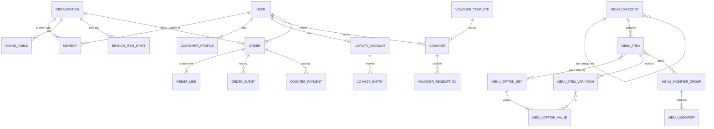

# Data model

← [Server standard](./README.md)

Designed from the product journeys ([system blueprint](../plans/system-blueprint.md)), not from the old external API. Table and column conventions: [architecture.md → Conventions](./architecture.md#conventions). Every table of ours has an `id` (UUID v7), `created_at` and `updated_at`; editable tables add `version`. Money is integer minor units + `currency`.

**[Open]** marks a business rule that isn't decided; the table is shaped so the answer fits later, but no code guesses it.

- [Overview](#overview)
- [Identity (Better Auth)](#identity-better-auth)
- [Branches](#branches)
- [Menu](#menu)
- [Media](#media)
- [Customers & loyalty](#customers--loyalty)
- [Orders & payment](#orders--payment)
- [Platform](#platform)
- [Open questions](#open-questions)

## Overview



Ownership: each feature's repository is the only code that touches its tables ([architecture.md → Features](./architecture.md#features)).

## Identity (Better Auth)

Generated by `@nuxtjs/better-auth` from the auth config; **never edited by hand**. Feature: `identity`.

| Table | Our additions | Notes |
|---|---|---|
| `user` | `role` (admin plugin: `customer` \| `admin`), `banned`, `ban_reason`, `ban_expires`; **`must_change_password`** (additional field) | One row per person, staff or customer |
| `session` | `active_organization_id`, `impersonated_by` (plugins) | Database sessions |
| `account` | | Password hash lives here |
| `verification` | | Email verification and reset tokens |
| `rate_limit` | | Auth rate limiting |
| `organization` | = a **branch**. Additional fields: `timezone` (IANA), `currency`, `address`, `phone`, `status` (`active` \| `archived`) | `slug` unique |
| `member` | `role`: `manager` \| `staff` | One row per person per branch |
| `invitation` | | Unused at launch (temporary-password onboarding) |

## Branches

Feature: `branches`.

| Table | Columns | Invariants |
|---|---|---|
| `dining_tables` | `branch_id` → organization, `label`, `qr_token_hash` (unique), `status` (`active` \| `archived`), `qr_rotated_at`, `version` | Unique (`branch_id`, `label`). The token itself is shown once when generated/rotated and never stored |
| `branch_hours` | `branch_id`, `weekday`, `open_minute`, `close_minute` | **Orders are accepted only while the branch is open** (D45); pickup is "as soon as possible" (no scheduled pickup times) |

## Menu

Brand-wide menu with per-branch state. Feature: `menu`. The design follows how Square, Toast, Uber Eats and Loyverse model menus (research and owner decisions, 2026-09-27, D44).

### Concepts and admin pages

| Admin page | What it holds | Used in the item form as |
|---|---|---|
| **Categories** | A two-level tree: categories and sub-categories | "Category" (a leaf only) |
| **Options** | Reusable **option sets** that define the versions of an item: Size (Small, Regular, Large), Temperature (Hot, Iced). **Names only, no prices** | "Options & prices": pick up to 2 sets; a price grid appears, one price per version (Latte Large $4.50, Tea Large $3.20) |
| **Add-ons** | Reusable **modifier groups** of extras with their **default prices**: Milk (Whole, Oat +$0.50), Extra shot (+$0.75), Sweetness | "Add-ons": pick groups; override a group's selection rules or an add-on's price for this item only when needed |
| **Menu items** | Items, their versions and prices, their add-on groups | |

The difference: an **option** decides *which version* of the item it is (exactly one per option set, priced per item: reports and sold-out work per version). An **add-on** is an *extra* on top (zero or more, priced the same everywhere by default).

```
Item form: Latte
  Category      Coffee › Espresso drinks
  Options       [Size] [Temperature]
                          Hot      Iced
                Small     $3.50    $4.00
                Regular   $4.00    $4.50
                Large     $4.50    $5.00      (a version can be switched off)
  Add-ons       [Milk] [Extra shot] [Sweetness]
```

An item without option sets has exactly one version with one price ("Croissant $2.50").

### Tables

| Table | Columns | Invariants |
|---|---|---|
| `menu_categories` | `parent_id` (nullable, self), `name`, `description`, `sort_order`, `status` (`active` \| `archived`), `version` | **Two levels:** a parent must have no parent. **A category holds either sub-categories or items, never both** (Square's nested categories break when items sit on a parent). Sort order is per parent. Archiving a parent archives its sub-categories |
| `menu_option_sets` | `name` ("Size"), `status`, `version` | Library. Used by many items |
| `menu_option_values` | `set_id`, `name` ("Large"), `sort_order`, `status` | Unique (`set_id`, `name`). Archiving a value hides the versions that use it; it never deletes them |
| `menu_items` | `category_id` (a leaf category), `name`, `description`, `image_asset_id`, `status` (`draft` \| `active` \| `archived`), `sort_order`, `version` | Customers see only `active` items in active categories. An item that was ever ordered is archived, never deleted |
| `menu_item_option_sets` | `item_id`, `set_id`, `sort_order` | PK (`item_id`, `set_id`). **At most 2 per item** |
| `menu_item_variations` | `item_id`, `price_minor`, `currency`, `status` (`active` \| `disabled`), `sort_order` | **Every item has at least one active variation.** With option sets: exactly one variation per combination of their values (the price grid), created when the sets are attached, "disabled" instead of deleted. Without: one variation with no values. An order line always names a variation |
| `menu_variation_option_values` | `variation_id`, `value_id` | One value per option set of the item; no two variations of an item share the same combination |
| `menu_modifier_groups` | `name` ("Milk"), `min_select`, `max_select` (null = no limit), `status`, `version` | Library. `max_select` ≥ `min_select`. Changes apply to every item using it (the page shows "Used by N items") |
| `menu_modifiers` | `group_id`, `name`, `price_delta_minor` (≥ 0), `is_default`, `sort_order`, `status` | Default price for every item |
| `menu_item_modifier_groups` | `item_id`, `group_id`, `sort_order`, `min_select` / `max_select` overrides (nullable) | PK (`item_id`, `group_id`) |
| `menu_item_modifier_prices` | `item_id`, `modifier_id`, `price_delta_minor` | Optional per-item price override ("oat milk +$0.75 on the large-cup drinks") |
| `menu_availability_rules` | `name` ("Breakfast"), `status`, `version` | |
| `menu_availability_windows` | `rule_id`, `weekday`, `start_minute`, `end_minute` | Several windows per rule. **Overnight windows are allowed** (D45): an end before the start means the next day, and the window belongs to the weekday it starts on. Times are in the branch timezone |
| `menu_category_availability`, `menu_item_availability` | links to rules | **No rule = available whenever the branch is open; several rules = available when any matches** (D45). An item is available only if its category is too |
| `branch_item_states` | `branch_id`, `variation_id`, `sold_out`, `updated_by` | The counter's "86" switch, per version (Large sold out, Regular still available). Later: a branch price override |
| `menu_translations` | Not at launch | **English only at launch** (D45). Added as `*_translations` tables when a second language is needed |

### Rules that keep the UI clean

- **Changing an item's option sets** regenerates its version grid: existing combinations keep their prices, new combinations start disabled with no price until one is entered, removed combinations are disabled (history keeps them).
- **Adding a value to an option set** (e.g. "Extra large" to Size) does not change existing items; each item's grid shows the new column as disabled until a price is set. **Archiving a value** disables the versions that use it everywhere.
- **Editing an add-on group** (names, default prices, rules) changes every item that uses it; per-item overrides stay.
- **Order lines snapshot** the item name, the version's option values ("Large, Iced"), its price, and each add-on's name and price, so later edits never change past orders.
- **Price of a line** = the version's `price_minor` + each chosen add-on's price (the item override if present, else the default).

### Categories API (step 3.1, D55)

Feature `server/features/menu/` (`categories.*`), contract `shared/contracts/menu-categories.ts`, permission `menu:read` / `menu:write`. Every write is one batch with its guards and an audit row (`menu.category.create|update|move|archive|restore|reorder`).

| Route | Does |
|---|---|
| `GET /api/admin/menu/categories?status=active\|archived\|all` | The tree in order: each top-level category followed by its sub-categories; `childCount` = active sub-categories |
| `GET /api/admin/menu/categories/{id}` | One category |
| `POST /api/admin/menu/categories` | `{ name, description?, parentId? }` → 201, at the end of its level |
| `PATCH /api/admin/menu/categories/{id}` | `{ version, name?, description?, parentId? }`: absent keeps; a new `parentId` moves it (`null`: to the top level) to the end of its new siblings |
| `POST /api/admin/menu/categories/{id}/archive` | `{ version }`: archives it and its active sub-categories |
| `POST /api/admin/menu/categories/{id}/restore` | `{ version }`: restores this one only, at the end of its level |
| `PUT /api/admin/menu/categories/order` | `{ parentId, items: [{ id, version }] }`: every active child of that parent, in the new order |

| Case | Result | Test |
|---|---|---|
| A sub-category under a sub-category, or a category with sub-categories moved under another (or under itself) | 422 `CATEGORY_DEPTH` | ✔ |
| Parent unknown or archived (also if archived between the check and the write) | 422 `PARENT_NOT_AVAILABLE` | ✔ (incl. the race) |
| Moving a category that gets a sub-category between the check and the write | 409 `VERSION_CONFLICT`, nothing changes | ✔ (race) |
| Two active siblings with the same name (case-insensitive), also two creates at once | 409 `CATEGORY_NAME_TAKEN` (partial unique indexes); archived ones don't count | ✔ (incl. the race; also on D1) |
| Stale version (before or during the write) | 409 `VERSION_CONFLICT` | ✔ (incl. the race) |
| Editing or archiving an archived category; restoring an active one | 409 `INVALID_STATE` | ✔ |
| Restoring a sub-category whose parent is archived | 409 `PARENT_ARCHIVED` | ✔ |
| Reorder missing a sibling, naming an old version, or a sibling added meanwhile | 409 `VERSION_CONFLICT`, nothing changes | ✔ (incl. the race) |
| Unknown body field | 400 (strict objects) | staging |

Positions (`sortOrder`) keep gaps after archiving and may tie after simultaneous creates (ties sort by name); only the relative order matters, and a reorder rewrites them 1…n. **"Items only in leaf categories"**: the category side (no sub-category under a sub-category) is enforced now; the item side (no item in a category with sub-categories, and no sub-category added to a category with items) comes with menu items in step 3.5.

### Options library API (step 3.3, D58)

Same feature (`options.*`), contract `shared/contracts/menu-options.ts`, permission `menu:read` / `menu:write`. **The set's `version` covers its values:** every change to a set or one of its values sends the set's version and moves it, so two admins can't overwrite each other's edits of one set. Each response is the whole set with its values (active ones in order, then archived ones). Audited as `menu.option_set.<action>`.

| Route | Does |
|---|---|
| `GET /api/admin/menu/option-sets?status=active\|archived\|all` | Sets by name, with their values |
| `GET /api/admin/menu/option-sets/{setId}` | One set |
| `POST /api/admin/menu/option-sets` | `{ name, values: [names] }` (1–20, unique) → 201 |
| `PATCH /api/admin/menu/option-sets/{setId}` | `{ version, name }` |
| `POST …/{setId}/archive`, `…/restore` | `{ version }` |
| `POST …/{setId}/values` | `{ version, name }` → 201, at the end |
| `PATCH …/{setId}/values/{valueId}` | `{ version, name }` |
| `POST …/{setId}/values/{valueId}/archive`, `…/restore` | `{ version }` (restore puts it at the end) |
| `PUT …/{setId}/values/order` | `{ version, valueIds }`: every active value, once |

| Case | Result | Test |
|---|---|---|
| Two active sets with the same name (case-insensitive), also two creates at once | 409 `OPTION_SET_NAME_TAKEN`; the losing create leaves no values behind | ✔ (incl. the race) |
| Two active values of one set with the same name | 409 `OPTION_VALUE_NAME_TAKEN`; the same name in another set is fine | ✔ |
| Stale set version (before or during the write), or two edits of one set at once | 409 `VERSION_CONFLICT`, nothing changes | ✔ (incl. both races) |
| Editing an archived set or value; restoring what isn't archived | 409 `INVALID_STATE` | ✔ |
| Archiving the last active value (also if another is archived meanwhile) | 422 `LAST_OPTION_VALUE`: archive the set instead | ✔ (incl. the race) |
| More than 20 active values (also if one is added meanwhile) | 422 `TOO_MANY_OPTION_VALUES` | ✔ (incl. the race) |
| A value of another set in the path | 404 | ✔ |
| Reorder that isn't exactly the active values | 409 `VERSION_CONFLICT` | ✔ |

**Not yet:** "used by N items" and what archiving a set or value does to items (hiding their versions) come with menu items in step 3.5.

Sources: [Square item options](https://developer.squareup.com/docs/catalog-api/item-options), [Square option sets](https://squareup.com/help/us/en/article/6689-item-options), [Square nested categories (community)](https://community.squareup.com/t5/Orders-Menu-Items-Catalog/Getting-Sub-categories-to-show-when-parent-category-is-selected/td-p/827866), [Toast menu hierarchy](https://doc.toasttab.com/doc/platformguide/adminMenuHierarchy.html), [Toast shared modifier groups](https://support.toasttab.com/en/article/Shallow-and-Deep-Copying-Menu-Items-and-Modifiers), [Uber Eats menu structure](https://developer.uber.com/docs/eats/guides/menu-integration), [Loyverse variants vs modifiers](https://help.loyverse.com/help/how-use-variants-items).

## Media

Feature: `media`.

| Table | Columns | Invariants |
|---|---|---|
| `media_assets` | `object_key` (unique), `mime_type`, `byte_size` (> 0), `sha256`, `state` (`temporary` \| `attached`), `uploaded_by`, `created_at`, `state_changed_at` | Temporary assets whose state is older than 24 h are deleted with their R2 object. An asset is attached to **one** record at a time |

Built in step 3.2 (D57): `server/features/media/`, contract `shared/contracts/media.ts`.

| Use | How |
|---|---|
| Upload | `POST /api/admin/media` (multipart, field `file`, permission `media:upload`) → 201 `{ id, url, mimeType, byteSize }`; audited as `media.asset.upload` |
| Serve | `GET /media/<key>` (public, `nosniff`, cached for a year: keys never change) |
| A record starts using an upload | `media.attachStatements(db, assetId, field)` in the record's batch: checks it now (422 `MEDIA_NOT_AVAILABLE` on `field`) and guards it in the batch (map a stale batch to `mediaNotAvailable(field)`) |
| A record drops or replaces it | `media.releaseStatement(db, assetId)` in the same batch; its 24 hours start then |
| Cleanup | `media:purge-temporary`, hourly at :05 |

| Case | Result | Test |
|---|---|---|
| Bytes aren't JPEG/PNG/WebP, or don't match the claimed type (an SVG or HTML file renamed `.png`) | 415 `UNSUPPORTED_MEDIA`, nothing stored | ✔, real-server |
| Over 5 MB | 413 `PAYLOAD_TOO_LARGE` (by `Content-Length` before reading, and by size after) | ✔, real-server |
| No file, or an empty one | 400 `VALIDATION_FAILED` | ✔, real-server |
| Storing the object fails | No row | ✔ |
| Writing the row fails | The object is removed again | ✔ |
| Two records attach the same upload at once | One wins; the other's batch fails its guard | ✔ (race) |
| An upload is cleaned up between a record's check and its write | The record's batch fails its guard | ✔ (race) |
| A record attaches an upload between the purge finding it and deleting it | Kept (conditional delete) | ✔ (race) |
| The object can't be removed after its row was deleted | Reported and logged; the object stays in R2 (no record can point at it) | ✔ |

## Customers & loyalty

Features: `customers`, `loyalty`.

| Table | Columns | Invariants |
|---|---|---|
| `customer_profiles` | `user_id` (PK, → user, cascade), `member_code` (unique, shown as a QR at the counter), `phone`, `marketing_opt_in`, `anonymized_at`, `created_at` | Every account has one, staff included: created on sign-up (Better Auth hook), in the staff-creation batch, or on first use. Member code: 8 random Crockford base32 characters shown `XXXX-XXXX` (40 bits; no I, L, O, U); typed codes are normalized (case, spaces, dashes, look-alikes) |
| `loyalty_accounts` | `user_id` (PK), `balance` (cached), `version` | `balance` ≥ 0, and always equals the sum of its entries |
| `loyalty_entries` | `account_id`, `points` (signed), `reason` (`earn_order` \| `exchange_voucher` \| `adjust` \| `reverse`), `source_type`, `source_id`, `idempotency_key` (unique), `actor_id`, `note` | **Append-only.** A correction is a new `reverse`/`adjust` entry with a reason |
| `voucher_templates` | `kind` (`amount_off` \| `free_item`), `amount_minor` (amount off), `variation_id` (free item), `points_cost` (null = staff-issue only), `valid_days` (default 30), `uses_per_voucher` (default 1), `status`, `version` | **One voucher per order, no minimum spend** (D45). An amount-off voucher never makes a total negative; a free item needs that item in the order |
| `vouchers` | `template_id`, `owner_id` → user, `code_hash` (unique), `source` (`points_exchange` \| `staff_issue`), `issued_by`, `issue_reason`, `remaining_uses`, `expires_at`, `status` (`active` \| `used` \| `expired` \| `revoked`), `version` | Exchange = negative loyalty entry + voucher **in one batch** |
| `voucher_redemptions` | `voucher_id`, `order_id`, `branch_id`, `staff_id`, `idempotency_key` (unique) | Conditional `remaining_uses > 0` update in the same batch: two cashiers can't use the last use twice |

Rules (D45):
- **Earning:** on completion, `floor(amount paid after the voucher discount / 1 USD)` points ($7.80 → 7). Entry key `earn:order:{orderId}`, so it applies once.
- **Exchange:** the **customer** exchanges points for a voucher on the website; staff redeem at the counter. The debit and the voucher are one batch.
- **Issue:** admins and managers may issue a voucher to a customer, with a reason (audited); it doesn't cost the customer points.
- **Adjust:** admins and managers may add or remove points with a reason.
- **Reversal:** when a completed order is refunded or cancelled, its earned points are reversed and a voucher used on it is restored if not expired.
- Staff never act on their own account (security.md → Identity).

## Orders & payment

Feature: `orders`.

| Table | Columns | Invariants |
|---|---|---|
| `orders` | `branch_id`, `customer_id` → user, `fulfillment` (`pickup` \| `dine_in`), `table_id` (dine-in only), `status`, `payment_status` (`unpaid` \| `paid` \| `refunded`), `voucher_id` (at most one), `subtotal_minor`, `discount_minor`, `total_minor`, `currency`, `pickup_number`, `business_day`, `note`, `placed_at`, `expires_at` (placed + 30 min while unpaid), `version` | A `CHECK`: `table_id` is set exactly when `fulfillment = 'dine_in'`. Totals are computed by the server. **No tax or service charge: menu prices are final** (D45) |
| `order_lines` | `order_id`, `item_id`, `variation_id` (references kept for reports), **snapshots** `item_name`, `variation_label` ("Large, Iced"), `unit_price_minor`, `quantity`, `line_total_minor` | Never changed after placing |
| `order_line_modifiers` | `line_id`, `modifier_id`, snapshots `name`, `price_delta_minor` | |
| `order_events` | `order_id`, `actor_id`, `from_status`, `to_status`, `reason`, `at`; unique (`order_id`, `to_version`) | The history the queue and the customer see |
| `counter_payments` | `order_id`, `method` (`cash_usd` \| `cash_khr` \| `khqr`), `amount_minor` (USD cents), `amount_khr` and `khr_per_usd` (cash in riel: the riel received and the rate used), `reference` (KHQR transaction ref, optional), `collected_by`, `idempotency_key` (unique) | One payment per order; recording it starts preparation |
| `exchange_rates` | `currency` (`KHR`), `per_usd` (e.g. 4100), `effective_from`, `set_by` | Set by an admin; append-only history; a riel payment records the rate it used |
| `branch_order_counters` | `branch_id`, `business_day`, `next_number` | Pickup numbers restart each business day (branch timezone) |

Order status (D45):

```
placed (unpaid) ──payment recorded──► preparing ──► ready ──► completed
      │
      ├──customer or staff cancels──► cancelled
      └──30 minutes unpaid──────────► cancelled (expired)
```

- No separate accept step: **recording the counter payment starts preparation.**
- A customer can cancel only while unpaid. Staff, managers and admins can cancel unpaid orders.
- **[Open] Q36:** can staff cancel an order that is already paid (money handed back at the counter), or does that need an admin refund? Refunds are admin only.
- A refund or cancellation after completion reverses loyalty (see above).

## Platform

Feature: `platform`.

| Table | Columns | Notes |
|---|---|---|
| `audit_events` | `actor_id` (`null` = system), `action`, `target_type`, `target_id`, `branch_id`, `metadata` (JSON, no secrets or personal values), `request_id`, `at` | Append-only, written in the same batch as the change. Indexes: target, `at`, (actor, `at`) |
| `idempotency_keys` | `actor_id`, `operation`, `key`, `request_hash` (SHA-256 of canonical JSON), `response` (JSON), `created_at`, `expires_at`; unique (`actor_id`, `operation`, `key`) | Removed after 24 h; a key counts until removed |
| `outbox_messages` | `kind`, `payload` (JSON), `status` (`pending` \| `sent` \| `failed`), `attempts`, `next_attempt_at`, `locked_until` (delivery claim), `last_error` (one line), `created_at`, `sent_at` | Must-not-lose side effects, delivered at least once by `platform:deliver-outbox` |

## Open questions

Tracked in one place, with the step each blocks and a suggested default: [progress.md → Open questions](../progress.md#open-questions--waiting-on-others). Still open for these tables: Q36 (cancelling a paid order) and Q24 (retention and erasure periods).
